### Continuous Delivery (Devops)

---

### [Infrastructure Continuous Delivery Using AWS Cloudformation](https://www.youtube.com/watch?v=TDalsML3QqY)

-   Use the intrinsic function `Fn:Sub` in YAML.
    

-   Use Changesets to preview the changes to infrastructure that will
    occur on update of a stack or stacks.
    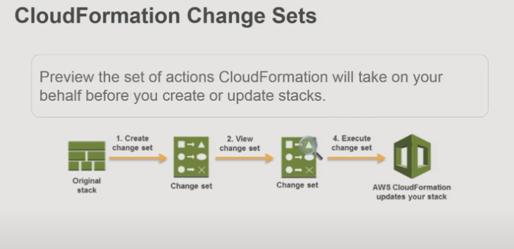

-   Use cross-stack references to share information between independent stacks:
    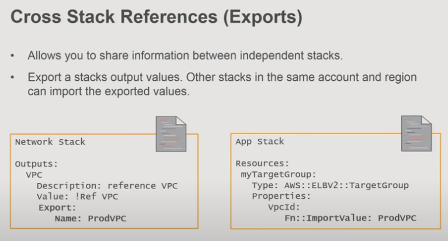

-   Nested stacks for template re-use
    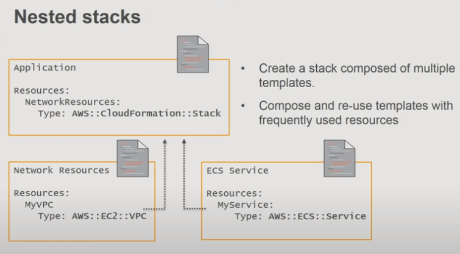

-   Considerations for Exports and Nested Stacks
    

### Sample Application

-   Examine a sample application
    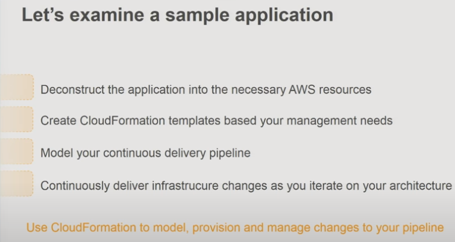

-   Microservices Application based on Amazon ECS
    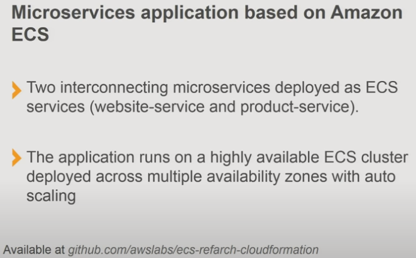

> Sample code for the application can be found [here](https://github.com/aws-samples/ecs-refarch-cloudformation)

-   Reference Architecture
    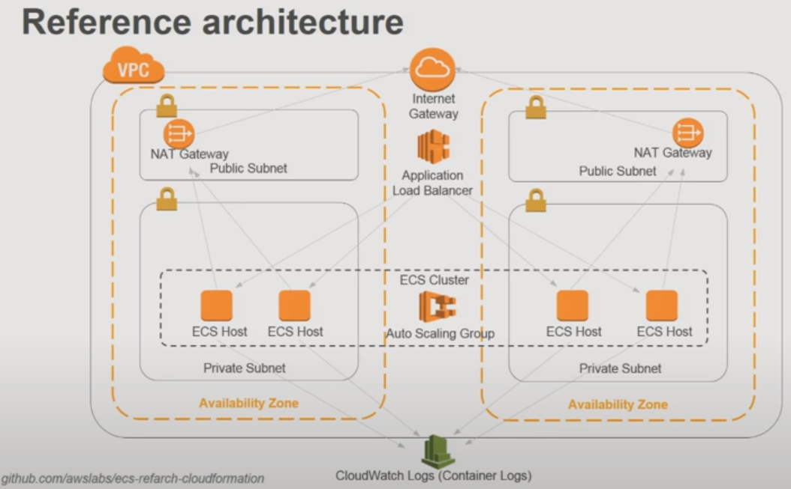

-   Decompose into AWS resource types
    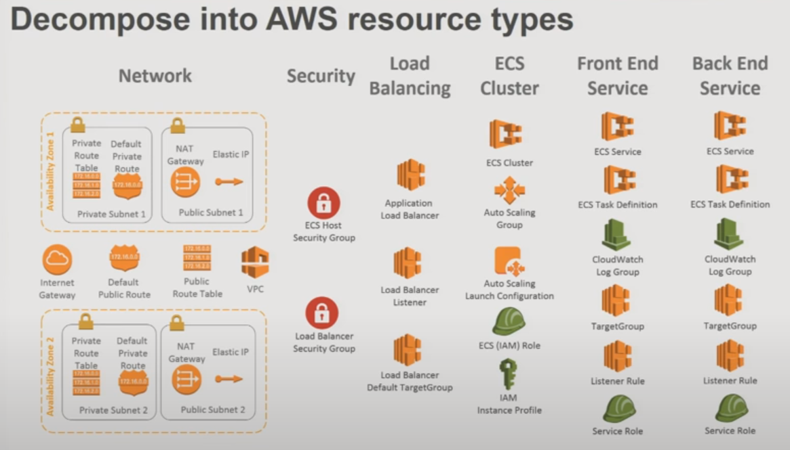

-   Build cloudformation templates based on this logical grouping
    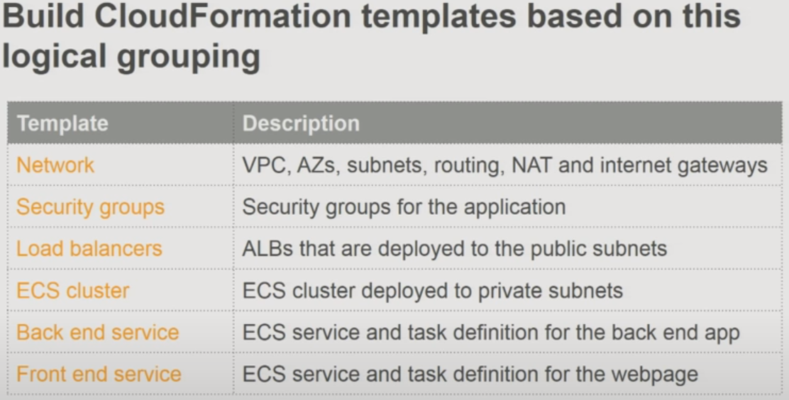

-   Set up flow configuration
    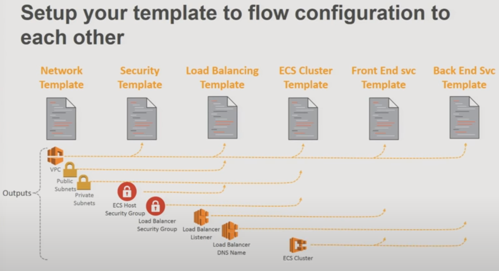

> Nested stacks allows for composability, the ability to manage code
> for stacks individually yet manage changes to a _single stack_
> deployment. A single stack template is large, unweildy and becomes
> a management headache, where sub-stacks are easier to manage.

-   Use Nested Stacks, or Cross Stack References
    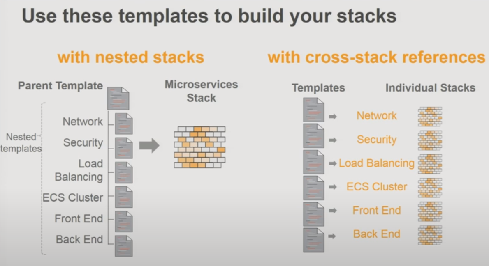

> Using cross stack references means you will need to manage the creation
> order and dependencies for each (component) stack individually.
> This is less of a headache than it appears, when applied using a
> pipeline to manage stack creation / updates.

-   Use CodePipeline to apply continuous delivery for infrastructure
    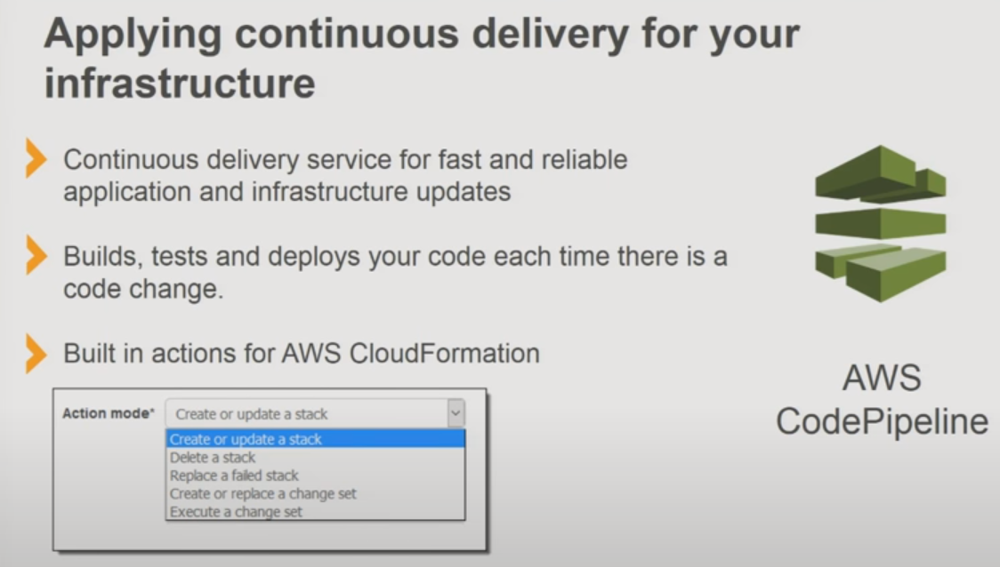

-   How does this align with Release Phases?
    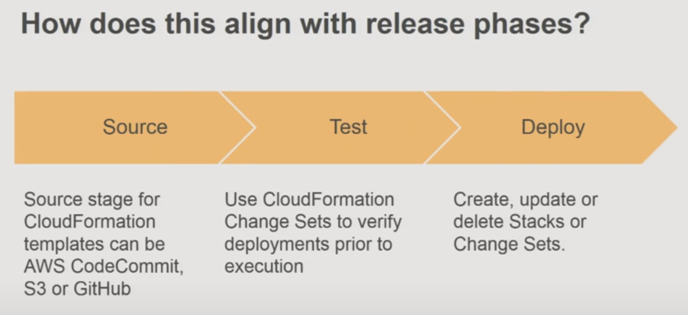

-   Modelling pipelines: networking pipeline and application pipeline
    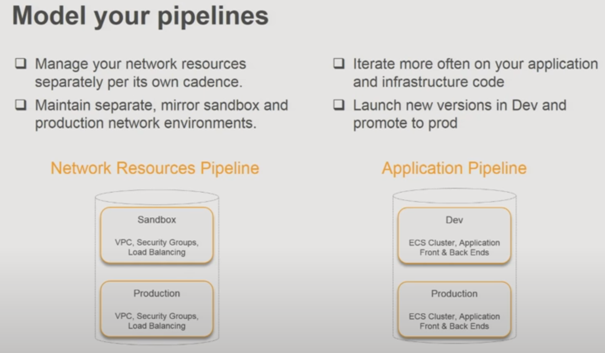

-   CodePipeline: network resources pipeline
    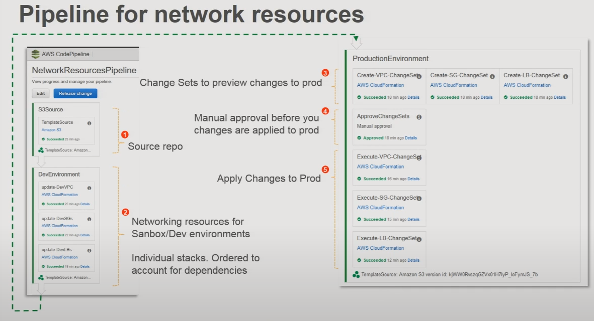

-   CodePipeline: application pipeline
    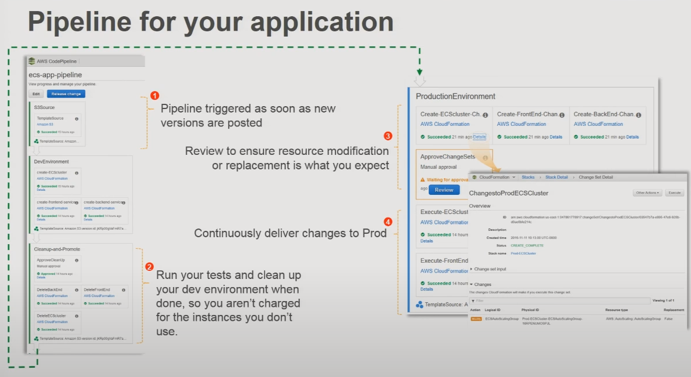

*   Create CodePipeline pipelines _using Cloudformation_
    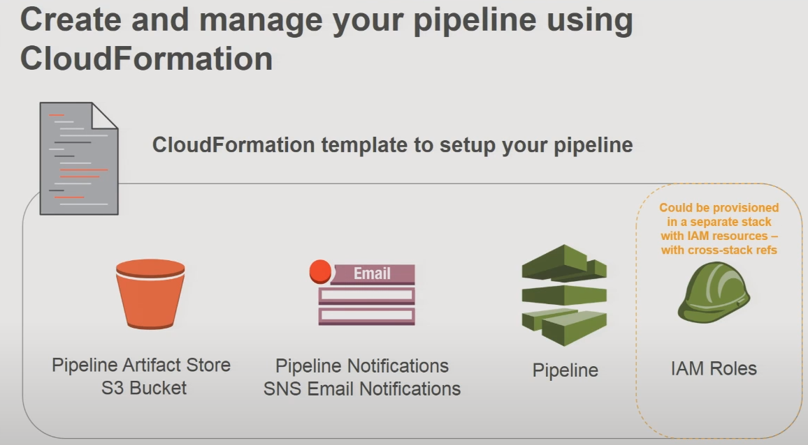

*   Create and manage pipeline using Cloudformation
    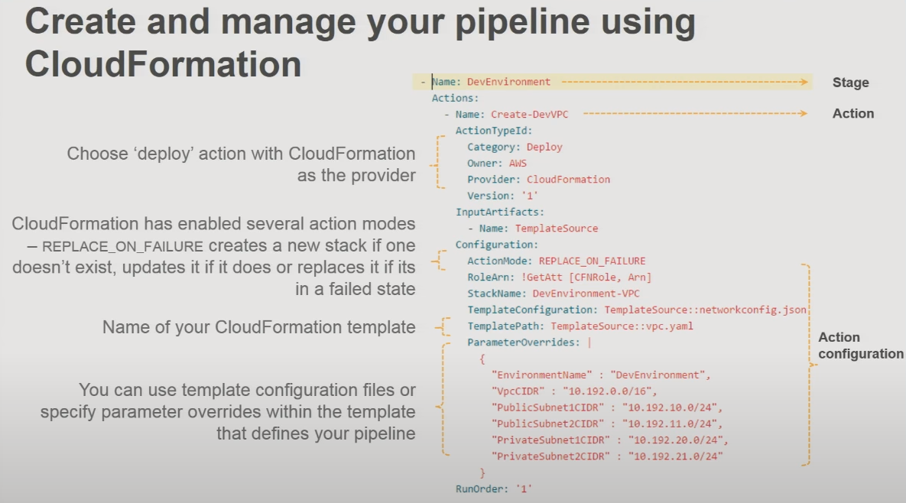

*   Editing the network pipeline YAML
    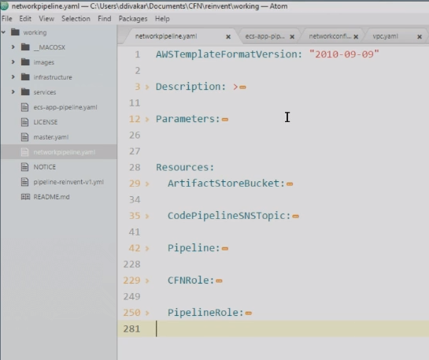

*   Parameters:
    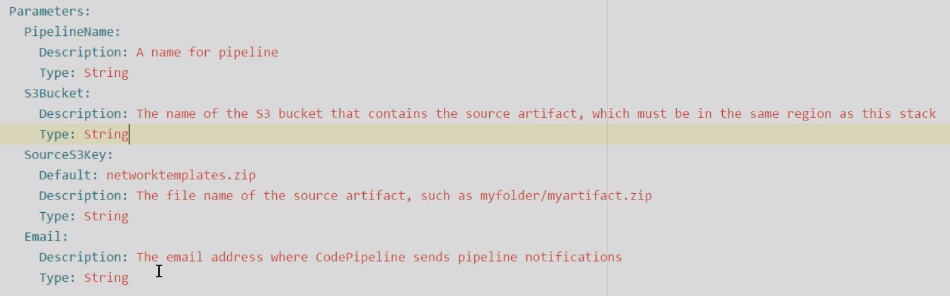

*   Resources:
    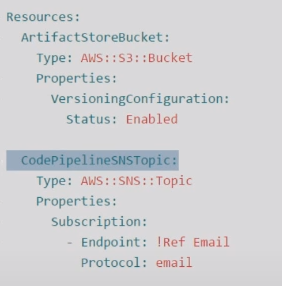

*   Pipeline:
    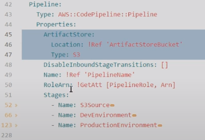

*   Stages.1 "S3Source"
    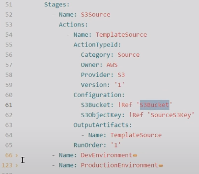

*   Stages.2 "DevEnvironment"
    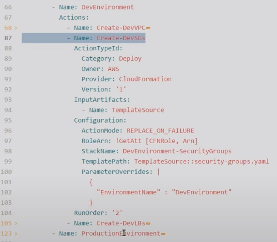

*   Stages.3 "Create-DevLBs"
    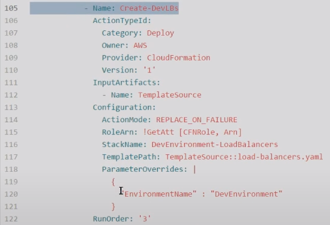

*   Stages.4 "Production Environment"
    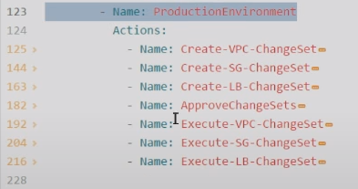

---

### [Devops on AWS: Advanced Continuous Delivery Techniques](https://www.youtube.com/watch?v=_xmYShSDDJg)

---

## Cloudformation

---

### [Cloudformation Master Class](https://www.youtube.com/watch?v=6R44BADNJA8)

---

### [Deep Dive on AWS Cloudformation](https://www.youtube.com/watch?v=01hy48R9Kr8)

---

### [Cloudformation Best Practices](https://www.youtube.com/watch?v=fVMlxJJNmyA)

---
