## Cloudformation notes

### Continuous Delivery (Devops)

---

### [Infrastructure Continuous Delivery Using AWS Cloudformation](https://www.youtube.com/watch?v=TDalsML3QqY)

- Use the intrinsic function `Fn:Sub` in YAML.
  

- Use Changesets to preview the changes to infrastructure that will
  occur on update of a stack or stacks.
  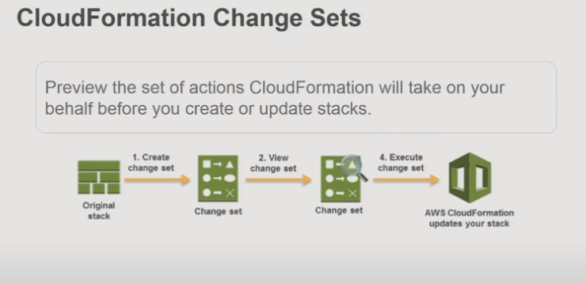

- Use cross-stack references to share information between independent stacks:
  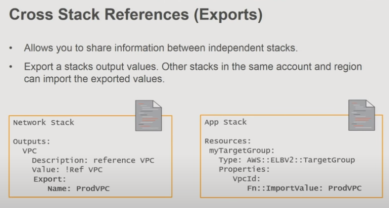

- Nested stacks for template re-use
  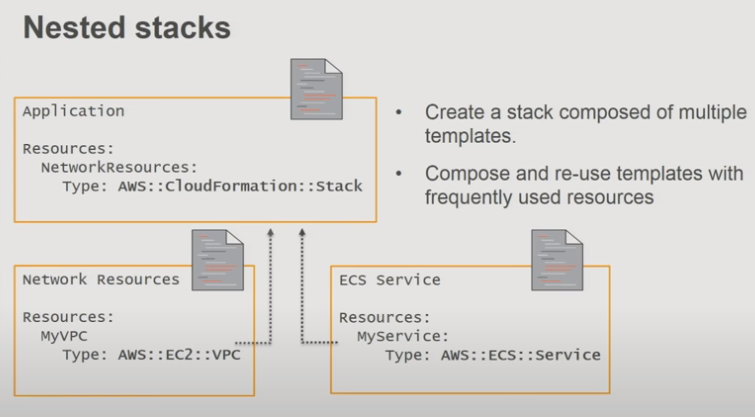

- Considerations for Exports and Nested Stacks
  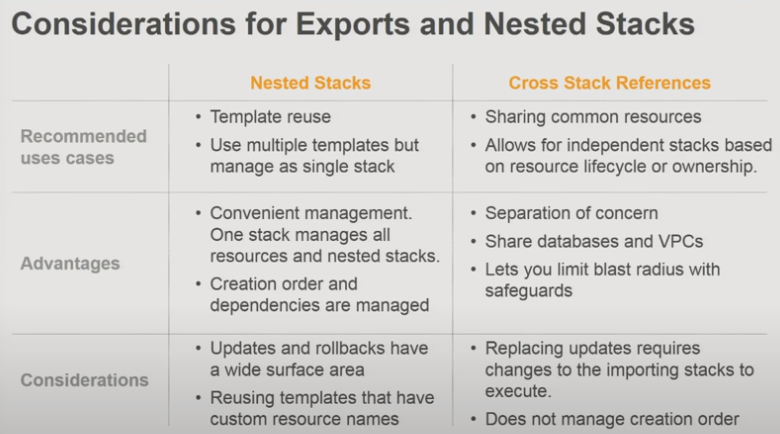

### Sample Application

- Examine a sample application
  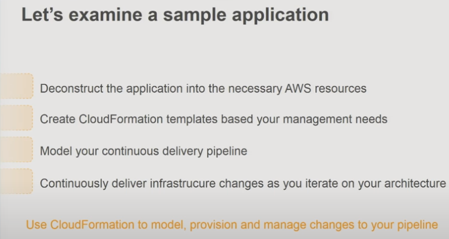

- Microservices Application based on Amazon ECS
  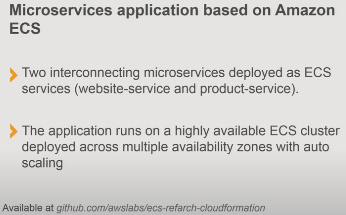

> Sample code for the application can be found [here](https://github.com/aws-samples/ecs-refarch-cloudformation)

- Reference Architecture
  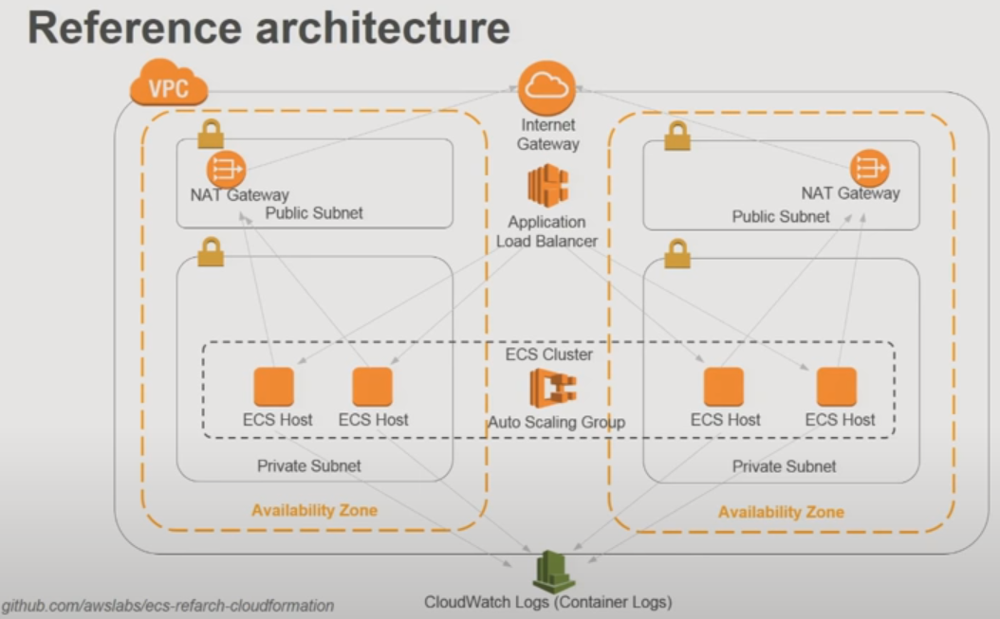

- Decompose into AWS resource types
  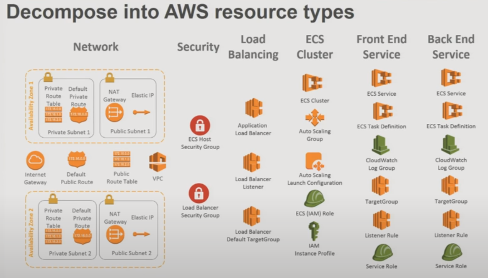

- Build cloudformation templates based on this logical grouping
  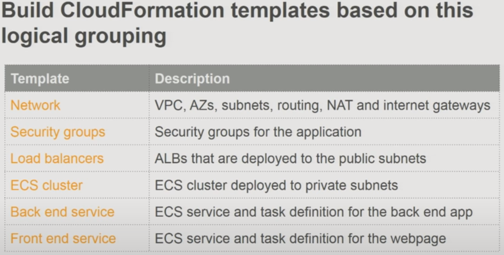

- Set up flow configuration
  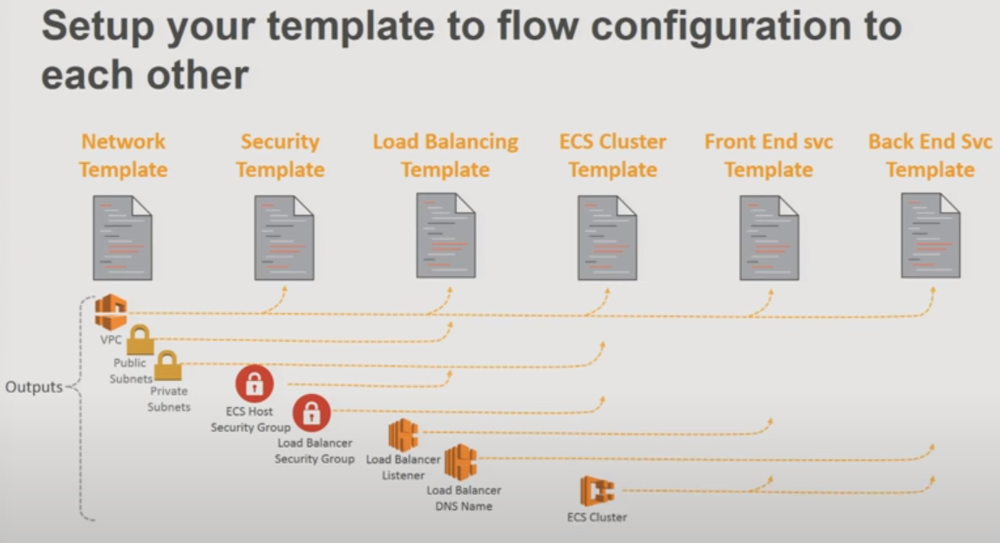

> Nested stacks allows for composability, the ability to manage code
> for stacks individually yet manage changes to a _single stack_
> deployment. A single stack template is large, unweildy and becomes
> a management headache, where sub-stacks are easier to manage.

- Use Nested Stacks, or Cross Stack References
  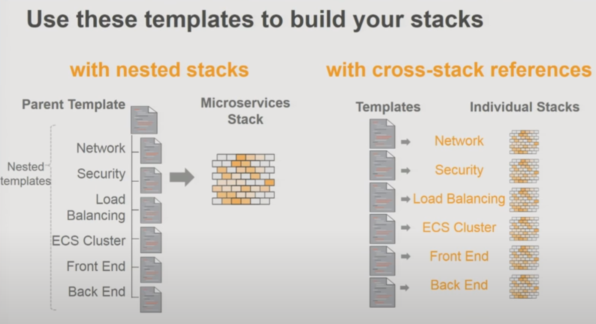

> Using cross stack references means you will need to manage the creation
> order and dependencies for each (component) stack individually.
> This is less of a headache than it appears, when applied using a
> pipeline to manage stack creation / updates.

- Use CodePipeline to apply continuous delivery for infrastructure
  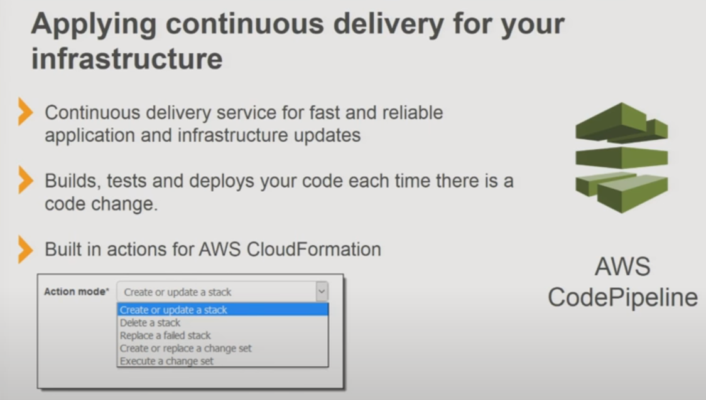

- How does this align with Release Phases?
  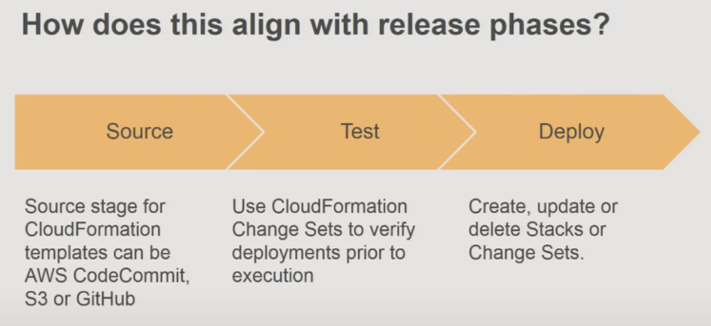

- Modelling pipelines: networking pipeline and application pipeline
  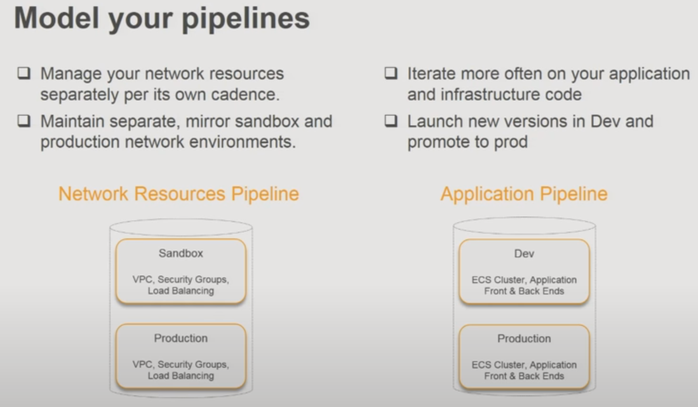

- CodePipeline: network resources pipeline
  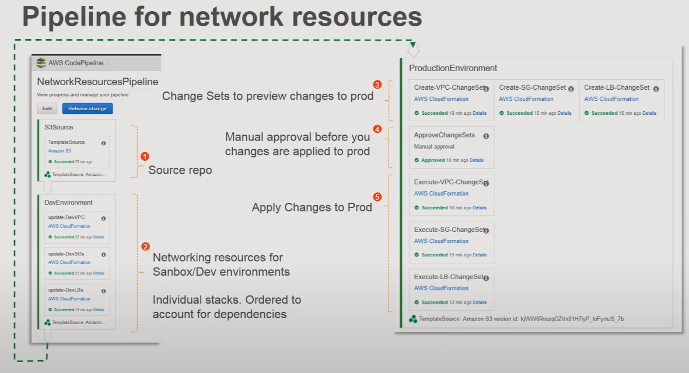

- CodePipeline: application pipeline
  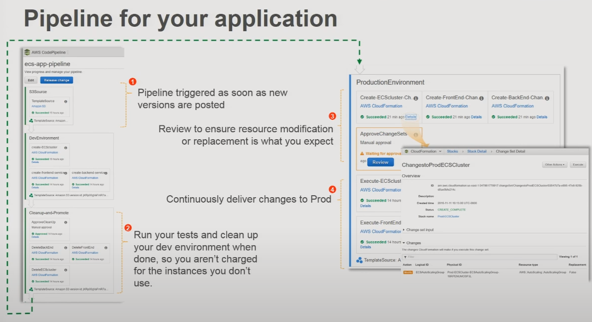

* Create CodePipeline pipelines _using Cloudformation_
  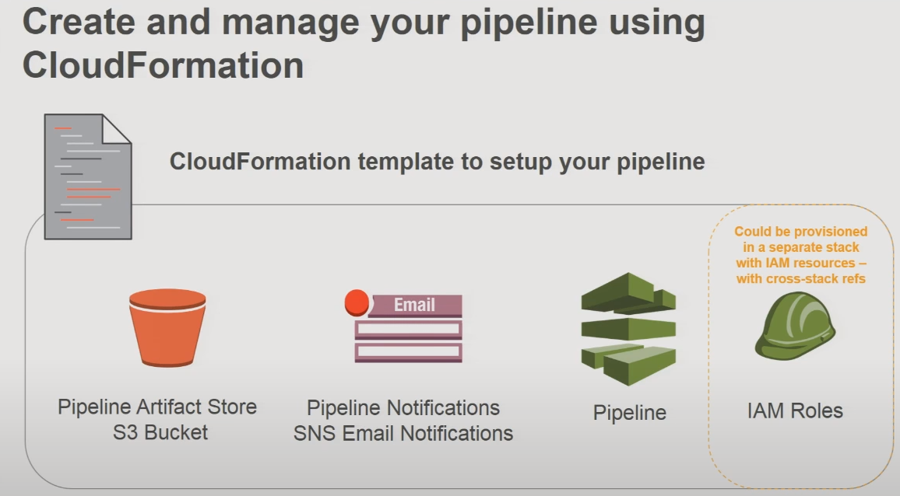

* Create and manage pipeline using Cloudformation
  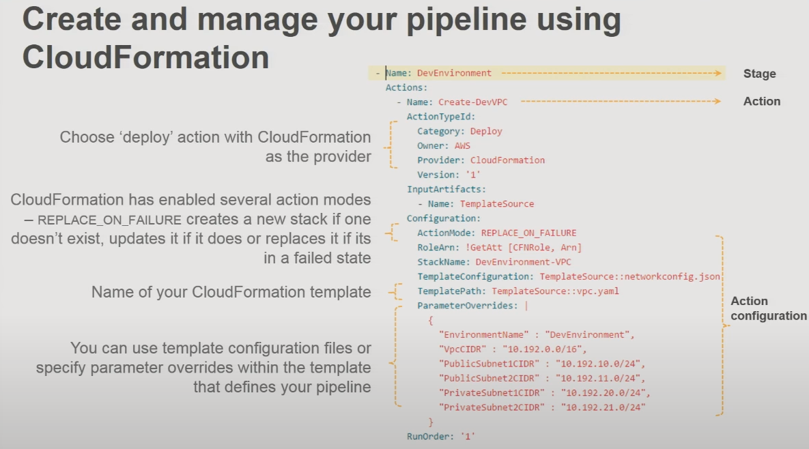

* Editing the network pipeline YAML
  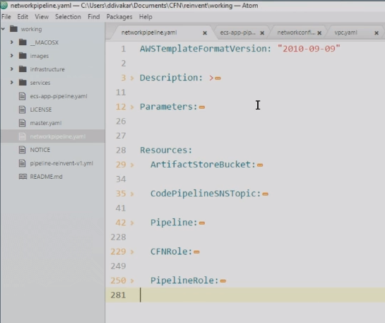

* Parameters:
  

* Resources:
  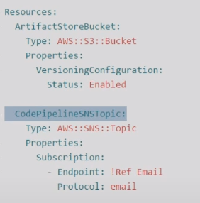

* Pipeline:
  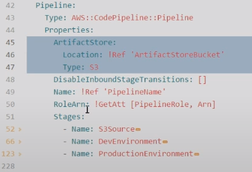

* Stages.1 "S3Source"
  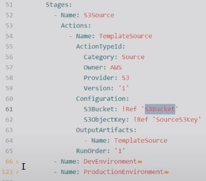

* Stages.2 "DevEnvironment"
  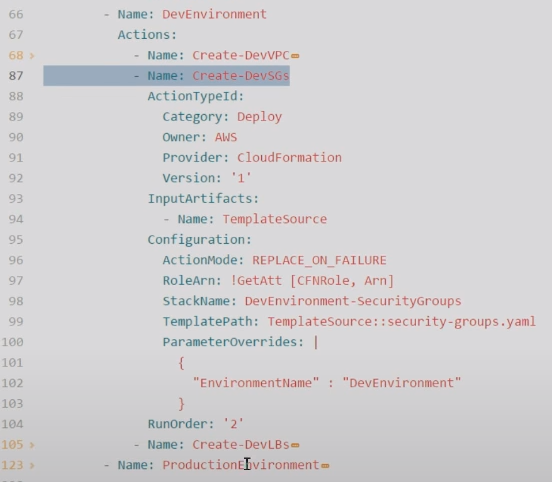

* Stages.3 "Create-DevLBs"
  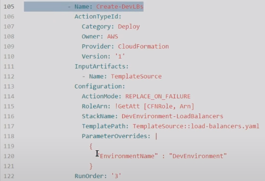

* Stages.4 "Production Environment"
  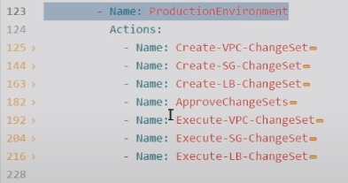

---

### [Devops on AWS: Advanced Continuous Delivery Techniques](https://www.youtube.com/watch?v=_xmYShSDDJg)

---

## Cloudformation

---

### [Cloudformation Master Class](https://www.youtube.com/watch?v=6R44BADNJA8)

---

### [Deep Dive on AWS Cloudformation](https://www.youtube.com/watch?v=01hy48R9Kr8)

---

### [Cloudformation Best Practices](https://www.youtube.com/watch?v=fVMlxJJNmyA)

---
