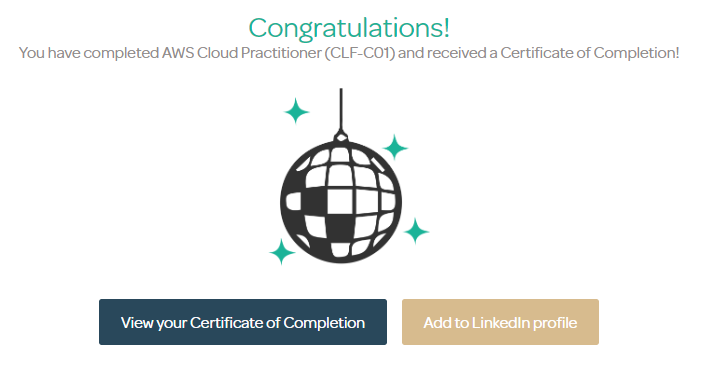

## AWS Certified Cloud Practitioner

### Notes and "wrong answers"

Based on the sample questions from [DigitalCloud](https://digitalcloud.training/certification-training/aws-certified-cloud-practitioner/)
and the book "AWS Certified Cloud Practitioner Training Notes 2020" by Neal Davis

---

> Which type of storage stores objects comprised of key, value pairs?

```markdown
# Explanation:

- Amazon S3 is an object-based storage system that stores objects that are comprised of key, value pairs

- Amazon DynamoDB stores items, not objects, based on key, value pairs

- Amazon EBS is a block-based storage system

- Amazon EFS is a file-based storage system
```

---

> Which of the facts below are accurate in relation to AWS Regions? (choose 2)

- [x] Each region consists of 2 or more availability zones
- [ ] Each region consists of a collection of VPCs
- [x] Each region is designed to be completely isolated from the other Amazon Regions
- [ ] Regions have direct, low-latency, high throughput and redundant network connections between each other
- [ ] Regions are Content Delivery Network (CDN) endpoints for CloudFront

```markdown
# Explanation:

- A region is not a collection of VPCs, it is composed of at least 2 AZs. VPCs exist within accounts on a per region basis

- Availability Zones (not regions) have direct, low-latency, high throughput and redundant network connections between each other

- Edge locations are (not regions) are Content Delivery Network (CDN) endpoints for CloudFront
```

[References](https://digitalcloud.training/certification-training/aws-certified-cloud-practitioner/aws-global-infrastructure/)

---

> Which service allows an organization to view operational data from multiple AWS services through a unified user interface and automate operational tasks?

- [ ] AWS OpsWorks
- [x] AWS Systems Manager
- [ ] AWS Config
- [ ] AWS CloudWatch

```markdown
# Explanation:

- AWS Systems Manager gives you visibility and control of your infrastructure on AWS. Systems Manager provides a unified user interface so you can view operational data from multiple AWS services and allows you to automate operational tasks across your AWS resources.

- AWS OpsWorks is a configuration management service that provides managed instances of Chef and Puppet.

- AWS Config is a fully-managed service that provides you with an AWS resource inventory, configuration history, and configuration change notifications to enable security and regulatory compliance.

- Amazon CloudWatch is a monitoring service for AWS cloud resources and the applications you run on AWS. You use CloudWatch for performance monitoring, not automating operational tasks.
```

---

> Which of the statements below is correct in relation to Consolidated Billing? (choose 3)

- [ ] You receive one bill per AWS account
- [x] You receive a single bill for multiple accounts
- [ ] You pay a fee per linked account
- [x] You can combine usage and share volume pricing discounts
- [x] You are not charged a fee

```markdown
# Explanation:

Consolidated billing has the following benefits:

- One bill – You get one bill for multiple accounts.

- Easy tracking – You can track the charges across multiple accounts and download the combined cost and usage data.

- Combined usage – You can combine the usage across all accounts in the organization to share the volume pricing discounts and Reserved Instance discounts. This can result in a lower charge for your project, department, or company than with individual standalone accounts.

- No extra fee – Consolidated billing is offered at no additional cost.
```

---

> With which service can a developer upload code from a Git repository and have the service handle the end-to-end deployment of the resources?

- [ ] AWS CodeDeploy
- [x] AWS Elastic Beanstalk
- [ ] Amazon ECS
- [ ] AWS CodeCommit

```markdown
# Explanation:

- AWS Elastic Beanstalk can be used to quickly deploy and manage applications in the AWS Cloud. Developers upload applications and Elastic Beanstalk handles the deployment details of capacity provisioning, load balancing, auto-scaling, and application health monitoring

- AWS CodeCommit is a fully-managed source control service that hosts secure Git-based repositiories

- AWS CodeDeploy is a fully managed deployment service that automates software deployments to a variety of compute services such as Amazon EC2,

- AWS Lambda, and your on-premises servers

- Amazon Elastic Container Service is a managed service for running Docker containers
```

---

> Which aspects of security on AWS are customer responsibilities? (choose 2)

- [x] Setting up account password policies
- [x] Server-side encryption
- [ ] Availability of AWS regions
- [ ] Physical access controls
- [ ] Patching of storage systems

```markdown
# Explanation:

- AWS are responsible for the “security of the cloud”. This includes protecting the infrastructure that runs all of the services offered in the AWS Cloud. This infrastructure is composed of the hardware, software, networking, and facilities that run AWS Cloud services.

- The customer is responsible for “security in the cloud”. Customer responsibility depends on the service consumed but includes aspects such as Identity and Access Management (includes password policies), encryption of data, protection of network traffic, and operating system, network and firewall configuration.
```

---

> How does AWS assist organizations’ with their _capacity_ requirements?

- [ ] You don’t own the infrastructure
- [ ] With AWS you don’t pay for data centres
- [ ] With AWS you only pay for what you use
- [x] You don’t need to guess your _capacity_ needs

```markdown
# Explanation:

- All of these statements are true; however, the question is specifically asking how AWS can assist with **capacity** requirements.

- i.e. how does AWS enable organizations to ensure they don’t over or under-provision their resources.

- The ability to scale on demand is the key advantage that can help them here as they can deploy what they know they need today and scale it as they need to tomorrow.
```

---

## Security

> Can you encrypt data in S3? Select the **true** statements.

- [ ] All data is encrypted if you select S3 server-side encryption
- [ ] Put the metadata in its own S3 bucket
- [x] Yes, if you put the metadata in a DynamoDB table and enable encryption during creation
- [ ] Yes, all data in S3 can be encrypted

```plaintext
You cannot encrypt metadata in S3 - you have to store it in a DynamoDB table and enable encryption during creation.
```

---

> You receive an alert about an issue between an application and the database servers. What should you check to ensure communication is working?

- [ ] NACL rules
- [x] Security group rules
- [ ] AWS IAM rules
- [ ] AWS KMS

```plaintext
Since the issue is communication between the application and server, you should check security group rules since security groups control access at the instance ENI level.
```

> \*\*My response: In a case where the application and the database are in different subnets, network communication involves route tables and therefore, NACLs. This is according to Well-Architected and indeed the diagrams shown in <insert video here>.

---

> What two encryption key options are available in the AWS console when you are uploading a new object with the S3 upload wizard?

- [ ] Customer key
- [x] Amazon S3 master-key
- [x] AWS KMS master-key
- [ ] AWS KMS stored customer key

```plaintext
The two encryption key options are available in the AWS web console when you are uploading a new object with the upload wizard are the Amazon S3 master-key and the AWS MKS master-key options.
```

---

> In the AWS Shared Responsibility Model, which of the following is _not_ your responsibility as the customer?

- [ ] Encrypting your data
- [ ] Managing security groups and NACLs
- [x] Decommissioning your data
- [ ] Patching your EC2 instances

```plaintext
In the AWS Shared Responsibility Model, customers are **not** responsible for decommissioning their own data. You as a customer do not own the phisical infrastructure and because of this you will not be responsible for decopmmissioning the hardware that your data resides on. AWS will be responsible for decommmissioning the data by AWS's preferred method of hardware destruction.
```

---

> How do you encrypt CloudTrail logs?

- [ ] Enable encryption
- [ ] Enable KMS encryption
- [x] No action is needed since they are automatically encrypted
- [ ] Send all logs to S3, and enable server-side encryption

```plaintext
By default, log files are encrypted using server-side encryption with S3-managed-encryption keys.
```

---

> Which option below **cannot** be used to import data into Amazon Glacier?

- [ ] AWS Glacier API
- [ ] AWS S3 Lifecycle policies
- [ ] AWS Glacier SDK
- [x] AWS Management Console

```plaintext
The AWS Management Console **cannot** be used to upload data to Glacier; the management console can only be used to create a Glacier vault that can be used to upload data.
```

---

> How can you make sure your organisation does not exceed its monthly budget?

- [ ] In cloudwatch, create an alarm that triggers each time the limit is exceeded
- [ ] Sign up for the free alert under billing preferences in the AWS Management Console
- [x] Create an email alert in AWS Budgets
- [ ] Set a schedule to regularly review the Billing and Cost Management dashboard each month

```plaintext
AWS Budgets gives you the ability to set custom budgets that alert you when your costs or usage exceed (or are forecasted to exceed) your budgeted amount. You can also use AWS Budgets to set reservation utilization or coverage taregets and receive alerts when your utilisation drops below the threshold you define. Resservation alerts are supported for Amazon EC2, Amazon RDS, Amazon Redshift, Amazon ElastiCache, and Amazon ElasticSearch reservations.
Budgets can be tracked at the monthly, quarterly or yearly level, and you can customise the start and end dates. You can further refine your budget to track costs associated with multiple dimensions, such as AWS service, linked account, tag and others. Budget alerts can be sent by email and/or Amazon Simple Notification Service (SNS) topic.
Budgets can be created and tracked from the AWS Budgets dashboard or via the Budgets API.
```

# I completed the course!!


