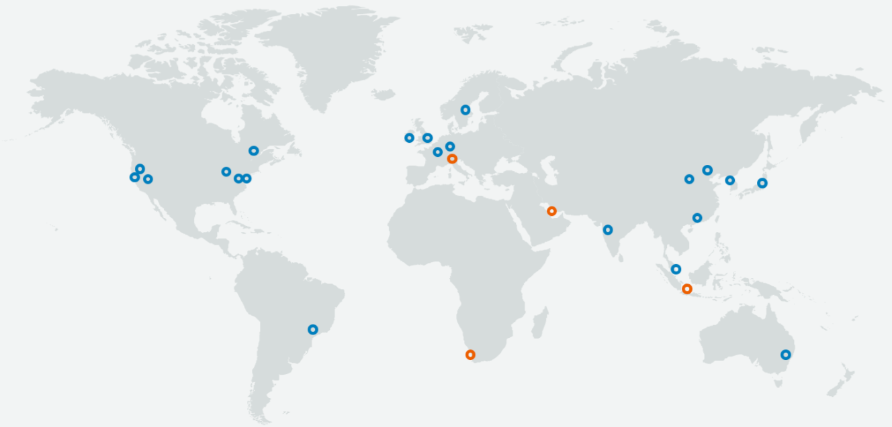

## Cloud Concepts and Terminology

### Elasticity

```plaintext
The ability to not only grow (scale) when required, but also reduce in size when required.
```

> Elasticity: growing and shrinking on demand

### Fault Tolerance

```plaintext
The ability to withstand a certain amount of failure and still remain functional (and/or be self-healing and return to full capacity)
```

### High Availability

```plaintext
The concept of something being accessible when you attempt to access it (and/or the abililty to access something via multiple platforms)
```

> A Load Balancer routing requests to servers in deployed to multiple regions / zones increases the availability of the service and its fault tolerance

## The AWS Global Infrastructure



The AWS global infrastructure consists of 21 regions around the world with 64 availability zones - and even more being added. The red markers on the map represent the regions that are coming soon.

At the highest level, AWS's physical infrastructure is made up of numerous regions located all around the world. Each region comprises multiple Availability Zones, which are where AWS data centres are located.

See an interactive world map of the AWS infrastructure.
[https://www.infrastructure.aws/](https://www.infrastructure.aws/)


### Availability Zones

Availability Zones (within a region) work together to make up a collection of your AWS resources. Properly designed applications will utilise multiple Availabnility Zones for **high availability** and **fault tolerance**. AZs have direct low latency connections between each other, and each AZ is isolated from the others to ensure fault tolerance.

