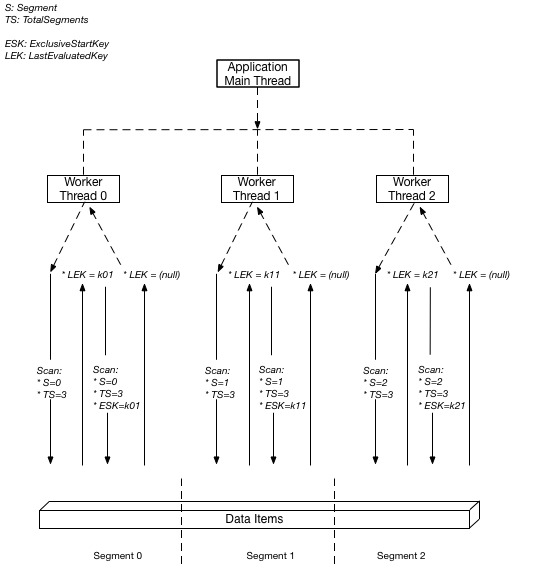

## AWS Certified Developer - Associate

Based on questions from https://digitalcloud.training/quizzes/aws-developer-associate-free-practice-test/

"Wrong Answers"

> A Developer needs to configure an Elastic Load Balancer that is deployed through AWS Elastic Beanstalk.
> Where should the Developer place the load-balancer.config file in the application source bundle?

- [ ] In the bin folder
- [x] In the .ebextensions folder
- [ ] In the root of the source code
- [ ] In the load-balancer.config.root

```markdown
# Explanation:

You can add AWS Elastic Beanstalk configuration files (.ebextensions) to your web application’s source code to configure your environment and customize the AWS resources that it contains.

Configuration files are YAML- or JSON-formatted documents with a .config file extension that you place in a folder named .ebextensions and deploy in your application source bundle.

For example, you could include a configuration file for setting the load balancer type into:

.ebextensions/load-balancer.config
```

```yaml
option_settings:
  aws:elasticbeanstalk:environment:
    LoadBalancerType: network
```

```markdown
# Requirements

- Location – Place all of your configuration files in a single folder, named .ebextensions, in the root of your source bundle. Folders starting with a dot can be hidden by file browsers, so make sure that the folder is added when you create your source bundle.

- Naming – Configuration files must have the .config file extension.

- Formatting – Configuration files must conform to YAML or JSON specifications.

- Uniqueness – Use each key only once in each configuration file.
  Therefore, the Developer should place the file in the .ebextensions folder in the application source bundle.
```

---

> A company currently runs a number of legacy automated batch processes for system update management and operational activities. The company are looking to refactor these processes and require a service that can coordinate multiple AWS services into serverless workflows.

> What is the MOST suitable service for this requirement?

- [ ] AWS Batch
- [ ] Amazon SWF
- [x] AWS Step Functions
- [ ] AWS Lambda

```markdown
# Explanation:

AWS Step Functions is a web service that enables you to coordinate the components of distributed applications and microservices using visual workflows. You build applications from individual components that each perform a discrete function, or task, allowing you to scale and change applications quickly.
```


```markdown
Step Functions provides a reliable way to coordinate components and step through the functions of your application. Step Functions offers a graphical console to visualize the components of your application as a series of steps. It automatically triggers and tracks each step, and retries when there are errors, so your application executes in order and as expected, every time. Step Functions logs the state of each step, so when things go wrong, you can diagnose and debug problems quickly.
```

---

> An application scans an Amazon DynamoDB table once per day to produce a report. The scan is performed in non-peak hours when production usage uses around 50% of the provisioned throughput.
> How can you MINIMIZE the time it takes to produce the report without affecting production workloads? (Select TWO).

- [ ] Increase read capacity units during the scan operation
- [x] Use the Limit parameter
- [ ] Use a Sequential Scan API operation
- [x] Use a Parallel Scan API operation
- [ ] Use pagination to divide results into 1 MB pages

```markdown
# Explanation:

By default, the Scan operation processes data sequentially. Amazon DynamoDB returns data to the application in 1 MB increments, and an application performs additional Scan operations to retrieve the next 1 MB of data.

The larger the table or index being scanned, the more time the Scan takes to complete. In addition, a sequential Scan might not always be able to fully use the provisioned read throughput capacity: Even though DynamoDB distributes a large table’s data across multiple physical partitions, a Scan operation can only read one partition at a time. For this reason, the throughput of a Scan is constrained by the maximum throughput of a single partition.

To address these issues, the Scan operation can logically divide a table or secondary index into multiple segments, with multiple application workers scanning the segments in parallel. Each worker can be a thread (in programming languages that support multithreading) or an operating system process. To perform a parallel scan, each worker issues its own Scan request with the following parameters:

- Segment — A segment to be scanned by a particular worker. Each worker should use a different value for Segment.

- TotalSegments — The total number of segments for the parallel scan. This value must be the same as the number of workers that your application will use.

The following diagram shows how a multithreaded application performs a parallel Scan with three degrees of parallelism.
```

[https://docs.aws.amazon.com/amazondynamodb/latest/developerguide/Scan.html#Scan.ParallelScan](https://docs.aws.amazon.com/amazondynamodb/latest/developerguide/Scan.html#Scan.ParallelScan)



---

> A developer needs to implement a caching layer in front of an Amazon RDS database. If the caching layer fails, it is time consuming to repopulate cached data so the solution should be designed for maximum uptime.
> Which solution is best for this scenario?

- [ ] Implement Amazon DynamoDB DAX
- [ ] Migrate the database to Amazon RedShift
- [ ] Implement Amazon ElastiCache Memcached
- [x] Implement Amazon ElastiCache Redis

```markdown
Amazon ElastiCache provides fully managed implementations of two popular in-memory data stores – Redis and Memcached. ElastiCache is a web service that makes it easy to deploy and run Memcached or Redis protocol-compliant server nodes in the cloud.

The in-memory caching provided by ElastiCache can be used to significantly improve latency and throughput for many read-heavy application workloads or compute-intensive workloads. It is common to use ElastiCache as a cache in front of databases such as Amazon RDS.

The two implementations, Memcached, and Redis, each offer different capabilities and limiations. As you can see from the table below, only Redis supports read replicas and auto-failover:
```

| Feature                         | Memcached                                                    | Redis (cluster mode disabled)                               | Redis (cluster mode enabled)                               |
| ------------------------------- | ------------------------------------------------------------ | ----------------------------------------------------------- | ---------------------------------------------------------- |
| Data persistence                | No                                                           | Yes                                                         | Yes                                                        |
| Data types                      | Simple                                                       | Complex                                                     | Complex                                                    |
| Data partitioning               | Yes                                                          | No                                                          | Yes                                                        |
| Encryption                      | No                                                           | Yes                                                         | Yes                                                        |
| High availability (replication) | No                                                           | Yes                                                         | Yes                                                        |
| Multi-AZ                        | Yes, place nodes in multiple AZs. No failover or replication | Yes, with auto-failover. Uses read replicas (0-5 per shard) | Yes with auto-failover. Uses read replicas (0-5 per shard) |
| Scaling                         | Up (node type); out (add nodes)                              | Single shard (can add replicas)                             | Add shards                                                 |
| Multithreaded                   | Yes                                                          | No                                                          | No                                                         |
| Backup and restore              | No (and no snapshots)                                        | Yes, automatic and manual snapshots                         | Yes, automatic and manual snapshots                        |

The Redis implementation must be used if high availability is required, as is necessary in this scenario. Therefore the correct answer is to use Amazon ElastiCache Redis.

---

> A developer is creating an Auto Scaling group of Amazon EC2 instances. The developer needs to publish a custom metric to Amazon CloudWatch.
> Which method would be the MOST secure way to authenticate a CloudWatch PUT request?

- [x] Create an IAM role with the PutMetricData permission and create a new Auto Scaling launch configuration to launch instances using that role

- [ ] Modify the CloudWatch metric policies to allow the PutMetricData permission to instances from the Auto Scaling group

- [ ] Create an IAM user with the PutMetricData permission and modify the Auto Scaling launch configuration to inject the user credentials into the instance user data

- [ ] Create an IAM role with the PutMetricData permission and modify the Amazon EC2 instances to use that role

### Explanation:

The most secure configuration to authenticate the request is to create an IAM role with a permissions policy that only provides the minimum permissions requires (least privilege). This IAM role should have a customer-managed permissions policy applied with the `PutMetricData` allowed.

The `PutMetricData` API publishes metric data points to Amazon CloudWatch. CloudWatch associates the data points with the specified metric. If the specified metric does not exist, CloudWatch creates the metric. When CloudWatch creates a metric, it can take up to fifteen minutes for the metric to appear in calls to ListMetrics.

The following images shows a permissions policy being created with the `PutMetricData` permission:

**CORRECT**: “Create an IAM role with the `PutMetricData` permission and create a new Auto Scaling launch configuration to launch instances using that role” is the correct answer

**INCORRECT**: “Modify the CloudWatch metric policies to allow the `PutMetricData` permission to instances from the Auto Scaling group” is incorrect as this is not possible. You should instead grant the permissions through a permissions policy and attach that to a role that the EC2 instances can assume.

**INCORRECT**: “Create an IAM user with the `PutMetricData` permission and modify the Auto Scaling launch configuration to inject the user credentials into the instance user data” is incorrect. You cannot “inject user credentials” using a launch configuration. Instead, you can attach an IAM role which allows the instance to assume the role and take on the privileges allowed through any permissions policies that are associated with that role.

**INCORRECT**: “Create an IAM role with the `PutMetricData` permission and modify the Amazon EC2 instances to use that role” is incorrect as you should create a new launch configuration for the Auto Scaling group rather than updating the instances manually.

---

SAA-001 Sample Questions

1. D
2. B, D
3. B
4. ~D~ C
5. A
6. C
7. B
8. D
9. C
10. C
