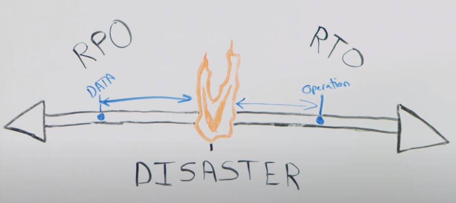

## Disaster Recovery

From [RPO and RTO Explained](https://www.youtube.com/watch?v=rD3nBaS3OG4)

> RPO - Recovery Point Objective

The maximum acceptable length of time during which data might be lost from the application due to a major incident. This metric will vary based on the ways that the data is used. For example, frequently modified user data could have an RPO of just a few minutes, whereas less critical, infrequently modified data could have an RPO of several hours. This metric describes the length of time only and does not address the amount or quality of data lost.

The length of time the business chooses for an RPO is factored on the criticality of the application, and can inform the architectural choices made during the design and implementation of the application.

> RTO - Recovery Time Objective

The maximum acceptable length of time the application can be offline. The time between the disaster event and full operations coming back online.

### Disaster Recovery Deployment Techniques

- Backup and Recovery (The Cold Method)

The Cold Method, a traditional model that requires periodically backing up the systems on tape and sending them off site. With AWS, there are several mechanisms available to achieve this and the choice would be purely based on the pre-decided RPO (recovery point objective). Using reliable services like S3, Direct Connect and Import Export, backup solutions can be defined using the reliable network connectivity AWS provides.
The overheads of using this approach includes defining retention times, ensuring security of archives and regularly testing the backups. The RPO in this case will be huge and there will be a downtime before restoration.

- Pilot Light

The data is mirrored, the environment is scripted as a template and a minimal version of the system is always running in a different region. The idea comes from a gas heater analogy where a small flame is always on a can quickly ignite the entire furnace, when required. The core element of the system, usually the database, is always activated for data replication and for the other layers, server images are created and updated periodically.
In the case of a disaster, the environment can be built out and scaled using the backed up AMIs around the pilot light. The Pilot Light approach reduces the RTO and RPO and provides the ease of just turning on the resources - the recovery takes just a few minutes. Amazon Cloudformation can be used to automate the provisioning of services.
Apart from relatively higher costs, the overheads include testing, patching and configuring the services to ensure they match the production environment.

- Warm Standby

Warm Standby ensures that the recovery time is reduced to almost zero by always running a scaled down version of a fully functioning environment, During the recovery phase, in case the production system fails, the standby infrastructure is scaled up to be in line with the production environment and DNS records are updated to route all traffic to the new AWS environment.
Essentially a smaller version of the full production environment is being run so the costs are very high compared to Pilot Light as the standby system is running 24/7. RTO and RPO are significantly reduced however.

- Multi-site

As the optimum technique in Disaster Recovery, Multi-Site duplicates the environment and there is always another environment sesrving live traffic running in a different region in an active-active configuration. DNS weighting is used to distribute incoming requests to both sites. Automated failover is configured to re-route traffic away from the affected site in the event of an outage. Once the primary site has been restored to a working state, we need to follow the failback process. Depending on the disaster recovery strategy, this means reversing the flow of data replication so that any updates received while the primary site was down can be replicated without loss of data.

The four techniques discussed above are not mutually exclusive and cna be used in combination depending on the RPO and RTO metrics. Irrespective of the disaster recovery requirements, a well-designed and tested recovery plan must ensure that the impact on a business's bottom line will bne minimal when disaster strikes. It has to be an amalgamation of a robust, flexible and cost-efficient selection of strategies that can be used to build or enhance the solution that is right for the business.

> _"Single Site" is not a real solution_

---
