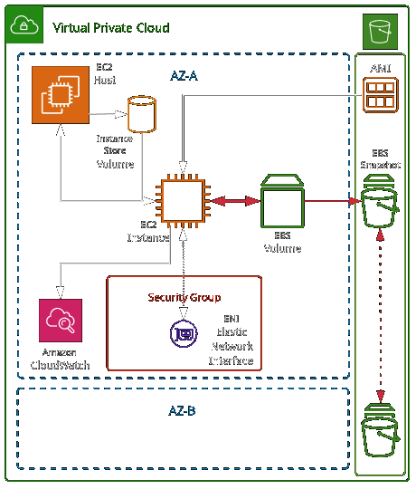
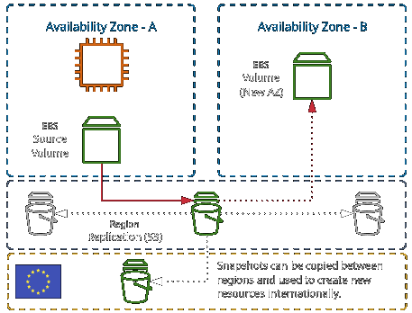

## EC2 High Level Concept

### Instance Metadata

Instance metadata is available at this address:

### `169.254.169.254/latest/meta-data`

```bash
# AMI id
169.254.169.254/latest/meta-data/ami-id
# Instance ID
169.254.169.254/latest/meta-data/instance-id
# Instance Type
169.254.169.254/latest/meta-data/instance-type
# Public IP address
169.254.169.254/latest/meta-data/public-ipv4
```



## Instance Types

The current instance families are:

- General Purpose
- Compute Optimised
- Memory Optimised
- Storage Optimised
- Accelerated Computing

## Instance Store Volumes

- Not all instance types come bundled with an instance store volume
- Storage optimised instances come with NVMe instance store
- Instance store volumes are **ephemeral**
- if the host is **stopped** or fails, it is allocated to another host, and
  the instance store volume is lost

```bash
mkdir /ephemeral
# example to "format" the instance store volume
mkfs -t ext4 /dev/nvme1n1
# mount the volume
mount /dev/nvme1n1 /ephemeral
```

- if the instance is **rebooted** the instance store is not lost

- with the I3en the instance store volume is capable of reaching over 2 million IOPS

## EBS - Elastic Block Store

- EBS does replicate data inside the AZ
- EBS volumes can be attached and removed from instances
- EBS volumes are _persistent_

```plaintext
- THROUGHPUT = IOPS * BLOCKSIZE
  - BS=256kb, IOPS=400 : TP=100mb/s
```

### Volume Types

1. Mechanical
   - sc1: Lowest cost, infrequent access, _CANNOT_ be a boot volume
   - st1: Low cost, infrequent access, _CANNOT_ be a boot volume
2. Solid State
   - gp2: Default, balance of IOPS / MiB/s - burst pool IOPS per GB
   - io1: Highest performance, can adjust size and IOPS separately

- To protect against AZ failure, EBS snapshots (to S3) can be used. Data is **replicated** across AZs in the region, and (optionally) internationally

## Exam Fact and Figures: EBS

- EBS supports a maximum per-instance throughput of **1,750 MiB/s** and **80,000 IOPS**. If you need more ... instance store volumes

### General Purpose (gp2) SSD

- _Default for most workloads_

- 3 IOPS/GiB (100 IOPS - 16000 IOPS)
- Bursts up to 3000 IOPS (credit based)
- 1 GiB - 16 TiB size, max throughput per volume of 250 MiB/s

### Provisioned IOPS (io1) SSD

- _Used for applications that require sustained IOPS performance_

- Large database workloads
- Volume size of 4GiB - 16 TiB up to 64,000 IOPS per volume
- Max throughput per volume of 1000 MiB/s

### Throughput optimised (st1) HDD

- _Low storage cost_

- Used for frequently accessed, throughput-intensive workloads (streaming, big data)
- Cannot be a boot volume
- Volume size of 500GiB - 16 TiB
- Per-volume max throughput of 500 MiB/s and IOPS 500

### Cold HDD (sc1) HDD

- _Lowest cost_

- Infrequently accessed data
- Cannot be a boot volume
- Volume size of 500 GiB - 16 TiB
- Per-volume max throughput of 250 MiB/s and 250 IOPS

## EBS Snapshots

- EBS snapshots are a **point-in-time** backup of an EBS volume stored in S3
- The initial snapshot is a **full copy** of the volume
- Future snapshots only store the data changed since the last snapshot
- When creating a snapshot of an instance or busy volume, it is recommended the instance be powered off, or in-memory caches (etc) are "flushed"
- Snapshots can be copied between regions, shared or automated using **Data Lifecycle Manager**


