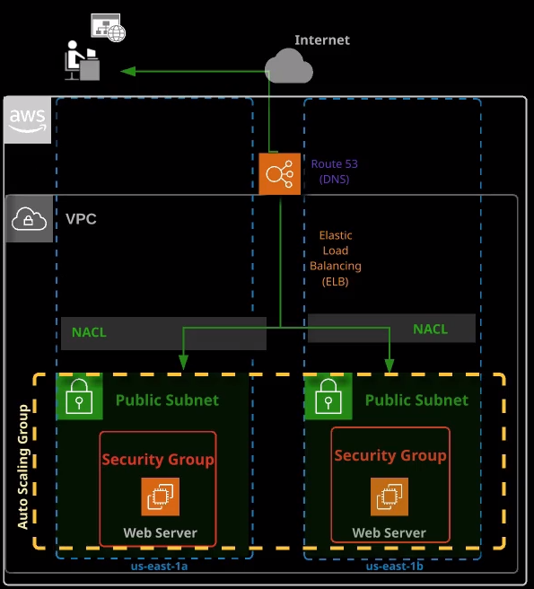
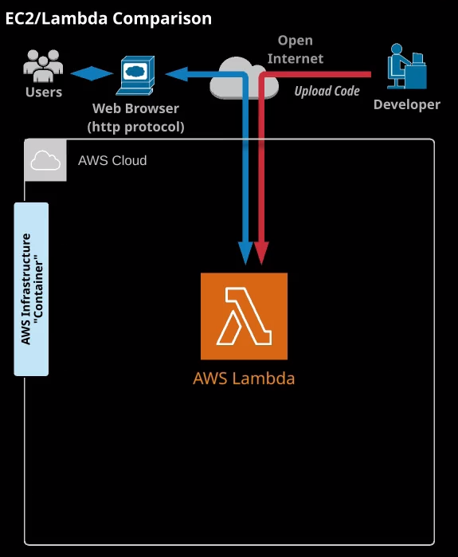

## Serverless

### Lambda vs EC2

Lambda is said to "replace EC2" (for the most part) because the majority of EC2 deployments are for a single service. Deploying to Lambda enables "just the code" to be uploaded and issues such as patch management and scale are no longer the responsibility of the customer.

#### Cost

Lambda deployments are insensitive to scale, and cost only as much as the consumption of compute time. For example, if an EC2 is left running 24 hours a day, because there might be requests of the service at any time, the cost incurred is for 24 hours worth of running time.

Contrast this with a Lambda deployment, where the only cost incurred is when a request is made of the service. This could be, say, 5 requests a day. The compute cost of the Lambda is only for those 5 requests, versus the EC2 example above which is for 24 hours of operation.

#### Scale

An EC2 instance that has been launched is constrained to the size of that instance (or in the case of an ASG, "those instances"). A Lambda deployment, on the other hand, is insensitive to scale. The same Lambda deployment is capable of handing 5 requests per day, or 5000 requests per minute.

### Serverless Application Model

An example: [https://github.com/aws-samples/serverless-app-examples/tree/master/javascript/microservice-http-endpoint](https://github.com/aws-samples/serverless-app-examples/tree/master/javascript/microservice-http-endpoint)

A sample SAM template for the AWS DynamoDB endpoint.

```yaml
microservicehttpendpoint:
    Type: AWS::Serverless::Application
    Properties:
        Location:
            ApplicationId: arn:aws:serverlessrepo:us-east-1:077246666028:applications/microservice-http-endpoint
            SemanticVersion: 1.0.4
        Parameters:
            TableNameParameter: YOUR_VALUE
```

## Comparison between EC2 and Lambda

### EC2 Deployment Composition



### Lambda Deployment Composition



## Lambda Benefits and Use Cases

### Additional Benefits

-   No servers to manage
-   Continuous scaling
-   Subsecond metering
    -   Billed for every 100ms of compute time
-   Integrates with almost all other AWS services

### Primary Use Cases

-   Data processing
-   Real-time file processing
-   Real-time stream processing
-   Build serverless back-ends for web, mobile, IoT, and third-party API requests
