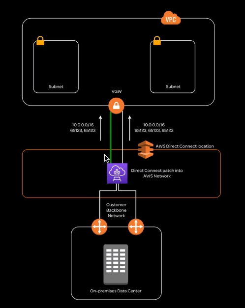
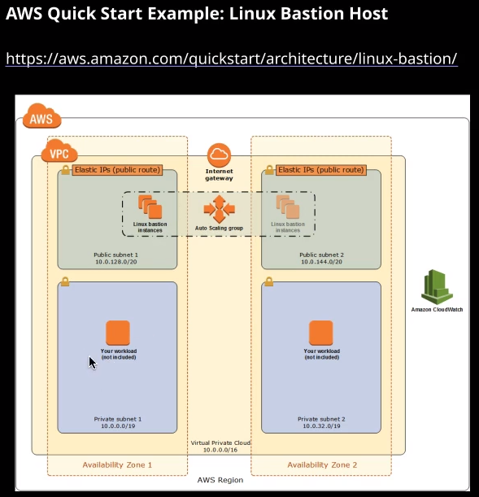

## Other "noteworthy" AWS Services

### Direct Connect

### QuickStart

## AWS Analytics

### Aws Athena

Athena is a serverless interactive query service used to analyse data in Amazon S3 using standard SQL. Because Athena is serverless, there is no infrastructure to manage. Athena is billed only for the queries that you run.

### Amazon EMR (Elastic Map/Reduce)

Amazon EMR provides a managed Hadoop framework. Amazon EMR is designed broad sets of big data, including log analysis, web indexing, machine learning, and financial analysis.

Amazon has other analytic services. Visit the [AWS Analytics Page](https://docs.aws.amazon.com/whitepapers/latest/aws-overview/analytics.html) to learn more.

### Amazon Lightsail

Lightsail is a private virtual server (instance) aimed at developers to provide everything needed to launch a service or project quickly. There are a number of "quick start" prepackaged setups to support a variety of operating systems and solutions.

### Amazon Rekognition

Amazon Rekognition provides video/image analysis. The service can identify objects, people, text, etc in the image/video. Rekognition also supports facial recognition and analysis.

### Amazon Device Farm (mobile lab)

Device Farm provides physical devices that can be used to test and troubleshoot applications on mobile devices, as well as help simulate real-world customer conditions.

### Amazon Mechanical Turk

Amazon Mechanical Turk (MTurk) is a crowdsourcing marketplace that simplifies outsourcing of processes and jobs to a distributed workforce. Practically any task that can be performed remotely (virtually) can be tasked via Mechanical Turk. Crowdsourcing is great for manual, time-consuming tasks that can be completed by distributed workers.
