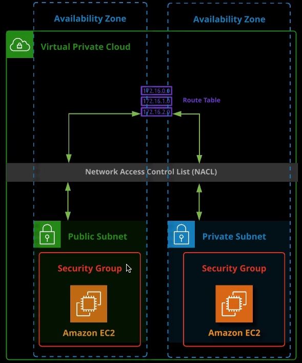

## AWS Networking

### Availability Zones

VPC containing two AZs, with a subnet in each.

A Public / Private subnet diagram.

To make a subnet "public", the route table has an internet gateway attached to it.

For a private subnet, there is no IGW attached to the route table.

### ALLOW and DENY

In the example below, the NACL is set up to ALLOW HTTP traffic, and DENY FTP traffic.

NACLs are STATELESS, which means that there must be explicit rules for INGRESS and EGRESS of traffic.

> For example,
> If HTTP INGRESS is allowed, but HTTP EGRESS is not, then this is a "misconfiguration" which will prevent a "visitor" from knowing if their request / post etc made it through to the server.

## FAQs

- A network can be compared to a neighborhood. The roads represent the network, and the houses represent the computers on the network.
- The cars represent the data moving though the ntwork. When a car (data) leaves the neighborhood (network), it is destined for another network
- A single street with houses represents a subnet with computers
- A VPC is a private part of the AWS cloud that customers create to hold AWS resources they wish to use
- A default VPC is created with a new AWS account is created
- Multiple VPCs may be created
- VPCs cross Availability Zones (AZs)
- Subnets may be public or private
- Private subnets do not have access to the internet, but public subnets _do_ have access to the internet (assuming a route table with a route to the internet gateway [IGW] exists). The terms "public" subnet and "private" subnet are labels.
- a route / no route to the IGW is what makes a subnet public or private
- An internet gateway provides internet connectivity. IGWs may be attached to an detached from a VPC
- Route tables are used to direct traffic to various destinations. Route tables may or may not have a route to an IGW.
- Security (firewall security) is provided by the NACL and the security group (discussed in the EC2 section). NACLs have rules to allow traffic into and out of subnets. A NACL can be assigned to one or more subnets.
