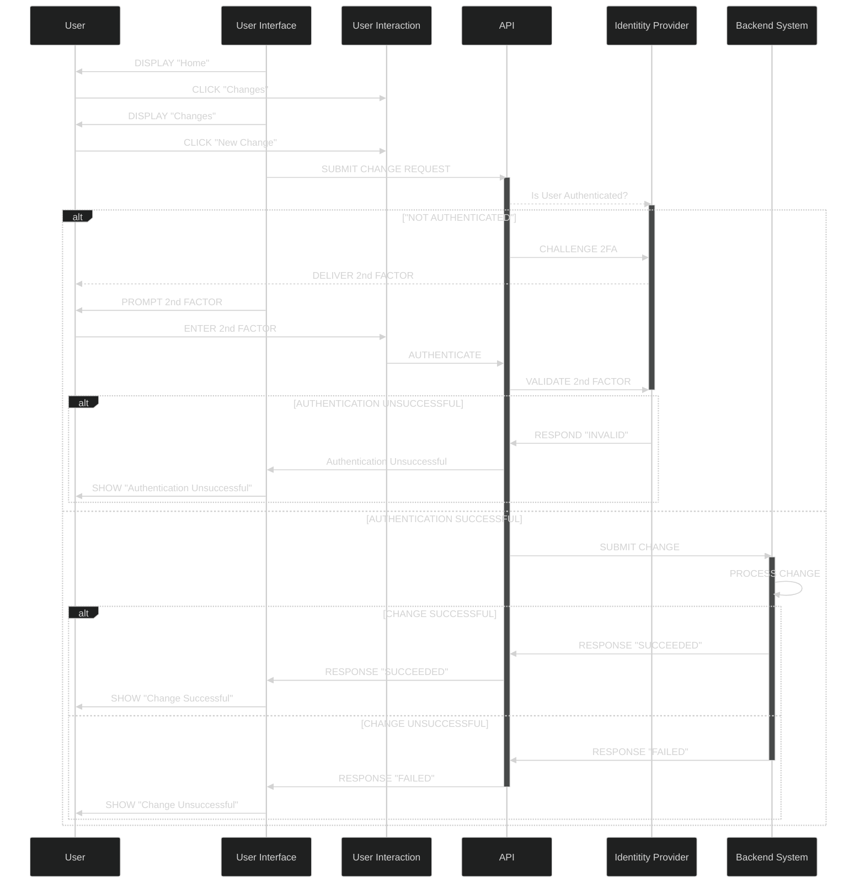

## CHANGE action with 2nd Factor Guard

```mermaid
%%{ init: {"theme":"dark"}}%%
sequenceDiagram
  participant USER as User
  participant UI as User Interface
  participant ACT as User Interaction
  participant API as API
  participant IDP as Identitity Provider
  participant BACKEND as Backend System
  UI ->> USER: DISPLAY "Home"
  USER ->> ACT: CLICK "Changes"
  UI ->> USER: DISPLAY "Changes"
  USER ->> ACT: CLICK "New Change"
  UI ->> API: SUBMIT CHANGE REQUEST
  activate API
  API -->> IDP: Is User Authenticated?
  activate IDP
  alt "NOT AUTHENTICATED"
    API ->> IDP: CHALLENGE 2FA
    IDP -->> USER: DELIVER 2nd FACTOR
    UI ->> USER: PROMPT 2nd FACTOR
    USER ->> ACT: ENTER 2nd FACTOR
    ACT ->> API: AUTHENTICATE
    API ->> IDP: VALIDATE 2nd FACTOR
    deactivate IDP
    alt AUTHENTICATION UNSUCCESSFUL
        IDP ->> API: RESPOND "INVALID"
        API ->> UI: Authentication Unsuccessful
        UI ->> USER: SHOW "Authentication Unsuccessful"
    end
  else AUTHENTICATION SUCCESSFUL
    API ->> BACKEND: SUBMIT CHANGE
    activate BACKEND
    BACKEND ->> BACKEND: PROCESS CHANGE
    alt CHANGE SUCCESSFUL
        BACKEND ->> API: RESPONSE "SUCCEEDED"
        API ->> UI: RESPONSE "SUCCEEDED"
        UI ->> USER: SHOW "Change Successful"
    else CHANGE UNSUCCESSFUL
        BACKEND ->> API: RESPONSE "FAILED"
        deactivate BACKEND
        API ->> UI: RESPONSE "FAILED"
        deactivate API
        UI ->> USER: SHOW "Change Unsuccessful"
    end
  end

```
