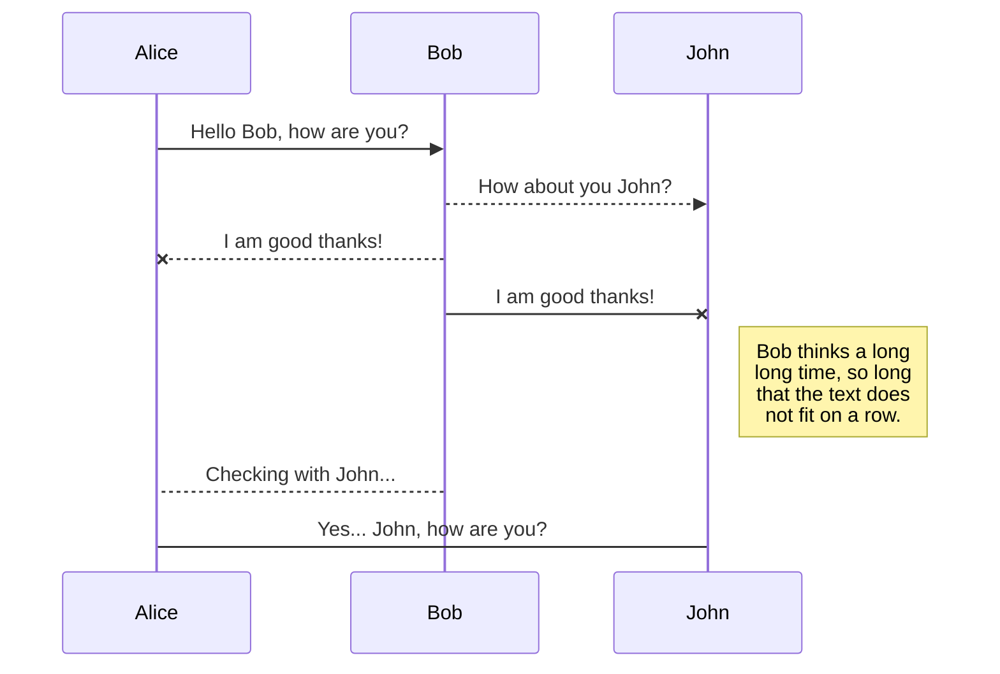

## Automate the ability to restore the system from completely nothing ##



In creating a software delivery flow it can be easy to overlook the test-first
approach in favour of "getting something up and running".

This is characterised as "business-pressure" or "time-to-market" but neglects
a key NFR of most commercially-critical software.

## Disaster Recovery ##

When a new feature (or set of features, eg. a CQRS microservices on k8s) is
kicked off, resisting the pressure to deliver a flimsy facade showing some fake
data can unlock the more potent business value of **disaster recovery**.

Say I have a set of APIs that are to be deployed into the container runtime
and their UI effect is to show a list of blog posts. This list is to be obtained
from a data store, and served to a client such as a web client or another API.

Traditionally (or maybe just *a lot*) the work would commence with the creation
of the API projects and they would be developed against Postman or maybe a 
selenium/BDD style acceptance project.

In the crazy new world of devops the things, implementing disaster recovery
*first* makes a lot of sense.

```gherkin
Given The first "disaster":
When The feature is entirely missing
Then the Feature must be delivered
```

This should cause the designers and engineers to re-frame the initial scope
towards infrastructure-as-code, pipelines-as-code etc -- in the event of a 
disaster, these scripts would be the thing that is to be run again, to set up
the services again.
