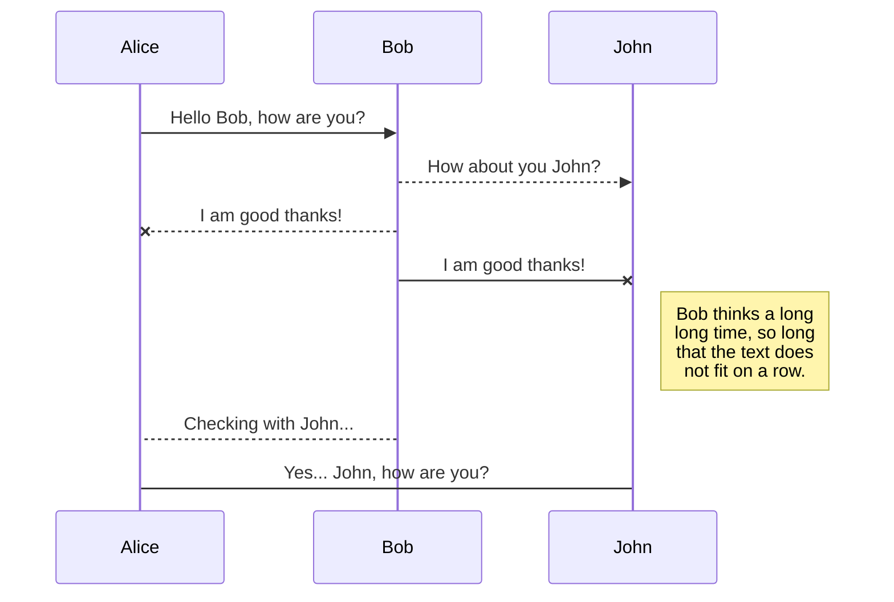
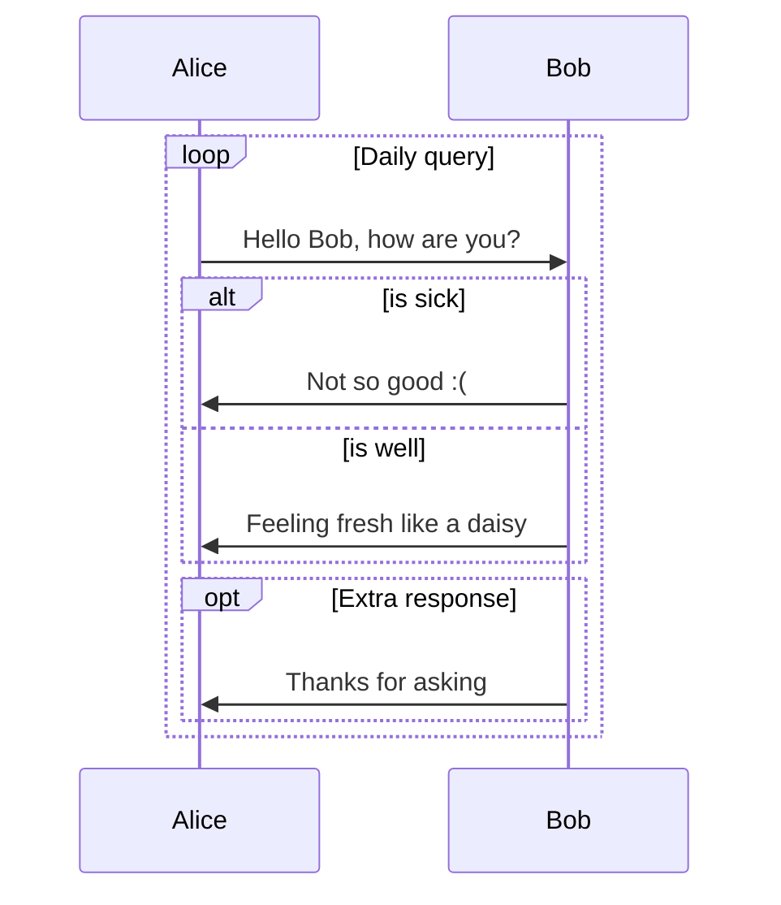
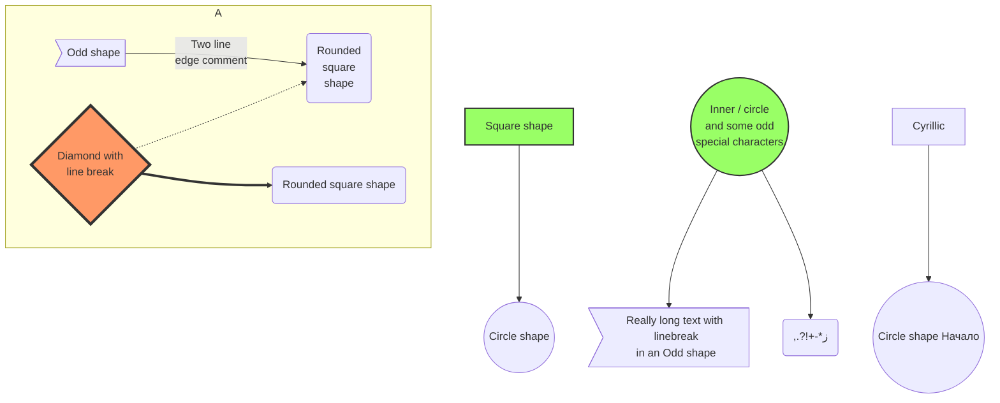

---

```typescript "linenos=true,linenostart=21"
sequenceDiagram
    Alice ->> Bob: Hello Bob, how are you?
    Bob-->>John: How about you John?
    Bob--x Alice: I am good thanks!
    Bob-x John: I am good thanks!
    Note right of John: Bob thinks a long<br />long time, so long<br />that the text does<br />not fit on a row.
    Bob-->Alice: Checking with John...
    Alice->John: Yes... John, how are you?
```

---



---

```c++ "linenos=table,hl_lines=[8,"15-17"],linenostart=199"
sequenceDiagram
    loop Daily query
        Alice->>Bob: Hello Bob, how are you?
        alt is sick
            Bob->>Alice: Not so good :(
        else is well
            Bob->>Alice: Feeling fresh like a daisy
        end

        opt Extra response
            Bob->>Alice: Thanks for asking
        end
    end
```

---


---


