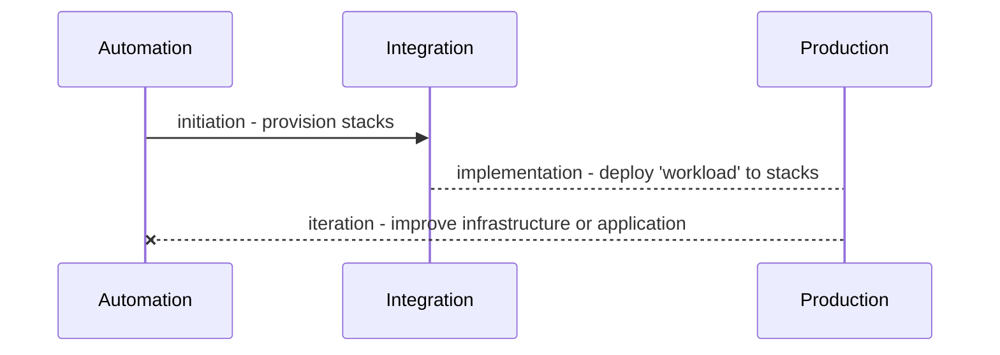
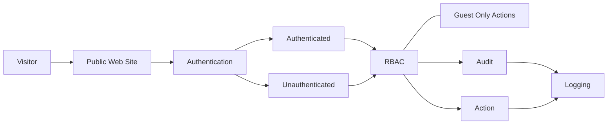
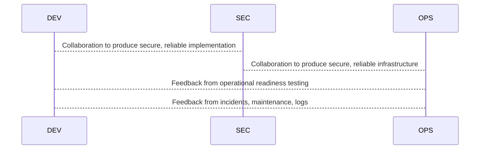
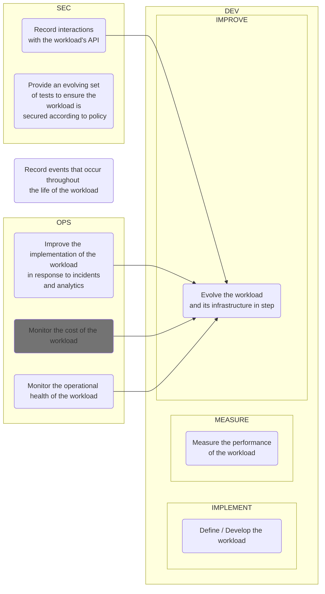

## Authorised Greeting

A simple "workload" for greeting "known" or "unknown" visitors to a site.

```plaintext
In order to enhance the personality of the public web site:

As the business
I want to greet unauthorised visitors formally
So that politeness is properly observed

As the business
I want to greet authorised visitors informally
So camaraderie is enriched
```

```gherkin

Scenario: users of the API are greeted

    Background:
    Given the API is available

    Given a visitor is <auth_level>
    * they request a greeting
    When they are greeted
    Then the greeting is <greeting>

    Examples:
    | auth_level    | greeting   |
    | unauthorised  | formal     |
    | authorised    | informal   |

```

## Notes for contemplating a simple serverless workload

This is a brain dump outlining the minimum required documentation of the
behaviour of the example workload. In this case, the example workload is a
simple "hello world" API, which returns a simple JSON object when queried.

If the request is 'authorised' the JSON contains some added, 'sensitive' information.

The example is developed, provisioned, and maintained using AWS tools such as

-   CodeCommit
-   CodeBuild
-   Cloudformation
-   Lambda
-   DynamoDB
-   S3
-   IAM
-   KMS

### A workload's maintenance cycle



### The example workload

```gherkin
As a visitor to the Public Web Site
I want to perform 'authenticated actions'
So I can interact with my account

Given an authenticated user
When they request the API 'hello'
Then the Public Web Site will execute that action
```





To ensure an effective and optimised workflow for maintaining the workload,
some things should be considered:

-   Evolve security in step with application code
-   Evolve infrastructure in step with application code
-   Including known and emergent security standards
-   Providing automated suites to ensure appropriate hardening
-   Including known and emergent performance standards
-   Respond to incidents with expanded testing

### Separation of duties for management of the workload


