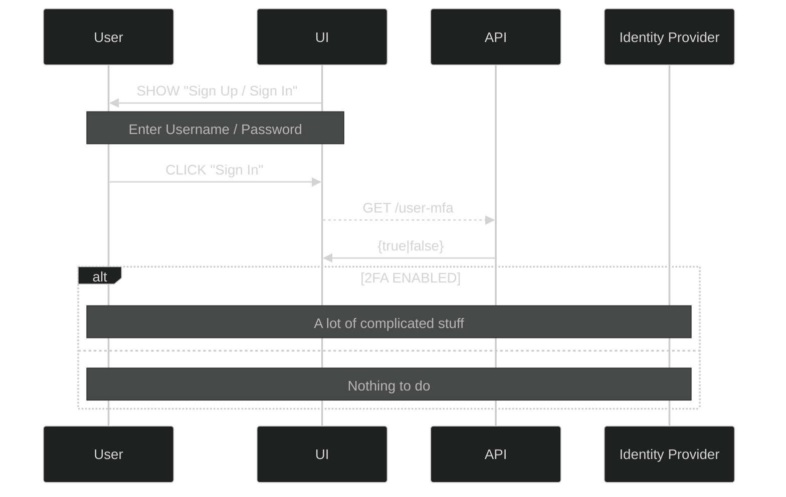

## Using 2FA to protect mutative actions

When deciding whether or not to use multi-factor (or two-factor for the purposes of this post) authentication to verify the identity of a user the tradeoffs are around implementation complexity, user experience and of course, security.

In this post, THE BUSINESS considers various things necessary, or not necessary. For example, THE BUSINESS considers it necessary that the user's password be at least 12 characters long.

The application uses an external system to apply changes to say, a user's profile data. Items such as "nickname", "favourite colour" etc are stored in the external system (it doesn't matter how or where).

Changes to the profile data are protected against naughtiness using multi-factor authentication. The second factor could be an SMS text, an authenticator app (such as Google Authenticator) or a one-time passcode sent to the user's email.

### READ or COMPUTE are not mutative

Non-mutative actions are not protected using the second factor. These actions, such as VIEW, are protected using the credentials factor. Username / password is considered to be sufficient protection for READ operations, but a second factor is considered necessary to guard against potentially site-wide harm that may be caused by a bad actor exploiting a mutative process.

### Nonrepudiation and identity binding

The second factor, while not providing complete protection (it can provide _added_ protection) can be used to warn users that their identity has been proven, and the provability of that user having performed a naughty action is increased considerably because they used the second factor to confirm their identity to the system. A bad actor would have to have compromised both factors to gain access, which ... _might be_ less likely than the actual user being the perpetrator of the naughty thing.

More identifying factors _should_ increase the likelihood of a verified identity. But they _might_ not.

[A sequence diagram](../2fa-sequence/) showing the 2nd factor guard in action.

## This looks entirely too complex - why not just enforce 2FA at login?

This is a common question. There are compelling arguments on both sides:

| 2FA                                                                                                                | !2FA                                                                                                                                                                                                                                                  | Tradeoff                  |
| ------------------------------------------------------------------------------------------------------------------ | ----------------------------------------------------------------------------------------------------------------------------------------------------------------------------------------------------------------------------------------------------- | ------------------------- |
| 2FA is SLOW. Forcing users to wait, sometimes for _minutes_ before they even get to see content is a major bummer. | A user should be able to at least login and click around to view things, maybe check up on something and if they are not going to do anything potentially "dangerous" then they are not required to wait for the 2FA, or go through the hassle of it. | They might "do" something |
| 2FA Sucks. It doesn't really do much anyway.                                                                       | Front-load all the waiting, and ensure that all actions performed by a given user are at least _mostly_ guaranteed to having been performed by the user. Mostly.                                                                                      | They can do everything.   |

### The trade-offs are clear, really it is a matter of posture and policy

At the end of the day, to 2FA or not to 2FA is the question ultimately answered by the stakeholders - and the better equipped to make that decision they are, the more appropriate to the user base that decision will be.

As with everything, "Ye Muste Use the MFA" or "MFA Suxe" are extreme views, and more often than not the real-world answer is....

#### It's complicated...
