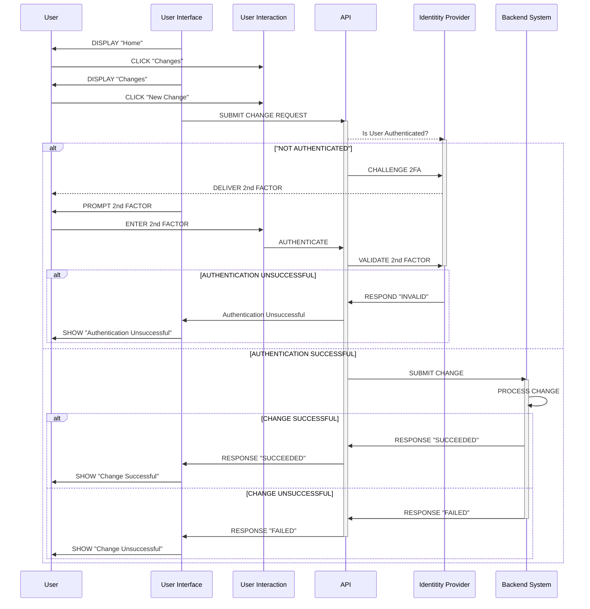

## Using 2FA to protect mutative actions

The application uses an external system to apply changes to say, a user's profile data. Items such as "nickname", "favourite colour" etc are stored in the external system (it doesn't matter how or where).

Changes to the profile data are protected against naughtiness using multi-factor authentication. The second factor could be an SMS text, an authenticator app (such as Google Authenticator) or even a one-time passcode sent to the user's email.

### READ or COMPUTE are not mutative

Non-mutative actions are not protected using the second factor. These actions, such as VIEW are protected using the credentials factor. The username / password factor is considered to be sufficient protection for READ operations, but a second factor is considered necessary to guard against potentially site-wide harm that may be caused by a bad actor exploiting a mutative process.

### Non-refutability as a non-physical screen

The second factor, while not providing complete protection (inasmuch as anything can provide _added_ protection) can be used to warn users that their identity has been proven, and the likelihood of that user performing a naughty action is increased considerably because they used the second factor to confirm their identity to the system.

