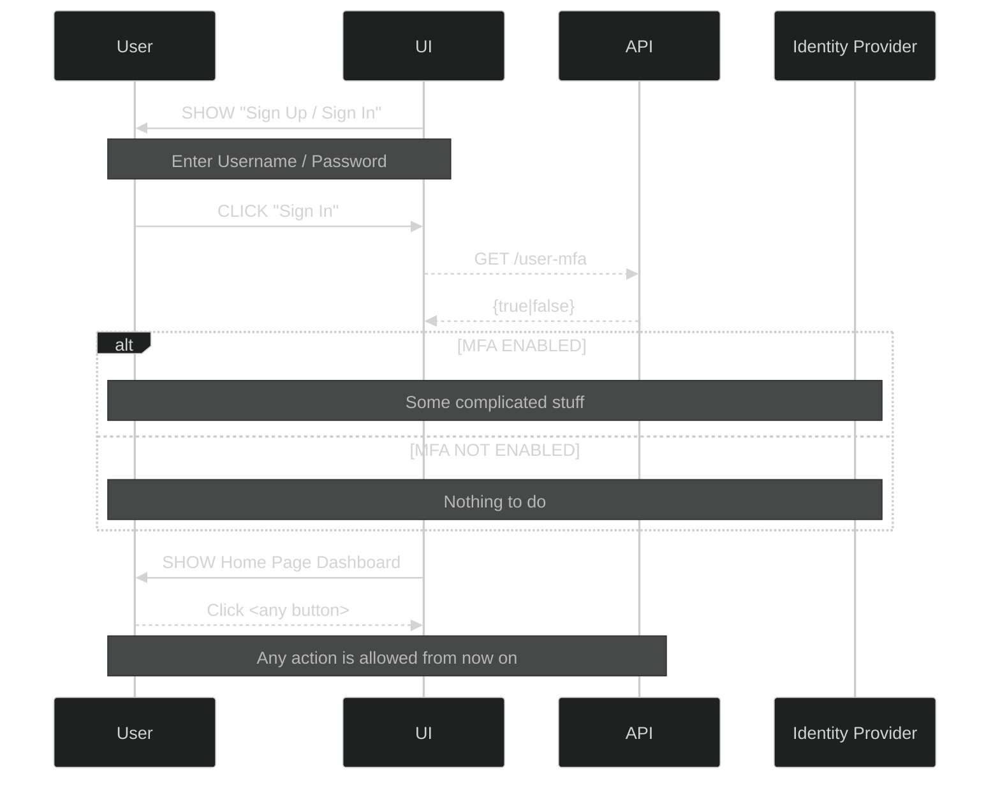

## Using transactional MFA to protect mutative actions

When deciding whether or not to use transactional MFA to verify the identity of a user the tradeoffs are around implementation security, useability and simplicity.

{}Transactional MFA is the __protection of specific actions__ by challenging for a second authentication factor. In general, these are transactional actions such as CHANGE some data. Like, to pay for something, alter a subscription, update a user's address. {}

### "Easy MFA" - Challenge at Login

In the simplest implementation and user journey, MFA is a part of the login process. Once the user is MFA'd at login, their identity is assumed to be constant for the duration of the session.

### Three Tradeoffs of MFA at Login

| Tradeoff   | Status                                                                                                                                                                             |
| ---------- | ---------------------------------------------------------------------------------------------------------------------------------------------------------------------------------- |
| Security   | Some risk: for example somebody logs in at a computer in say, a classroom or office, and walks away without locking their screen or logging out.                        |
| Useability | Extra time spent waiting and extra buttons clicked, text copied-and-pasted (or worse, read from the phone and typed into the computer) and some users will find that disagreeable. |
|✅ **Simplicity** | The implementation is at its simplest when MFA'ing at login.                                                                                                                       |

### The Example System

The application uses an external system to apply changes to say, a user's profile data. Items such as "nickname", "favourite colour" etc are stored in the external system (it doesn't matter how or where).

With transactional MFA implemented, changes to data are protected against naughtiness using multi-factor authentication. The second factor could be an SMS text, an authenticator app (such as Google Authenticator) or a one-time passcode sent to the user's email.

### READ or COMPUTE are not 'sensitive'

When applying transactional MFA, THE BUSINESS has decided that non-mutative actions are not to be protected using the second factor.

These actions are protected using the credentials factor alone. Username / password is considered to be sufficient protection for READ and COMPUTE operations, but a second factor is considered necessary to guard against potentially site-wide harm that may be caused by a bad actor exploiting a mutative process.

### Nonrepudiation and identity binding

The second factor, while not providing complete protection (it can provide _added_ protection) can be used to warn users that their identity has been proven, and the provability of that user having performed a naughty action is increased considerably because they used the second factor to confirm their identity with the system.

A bad actor would have to have compromised both factors to gain access, which ... _might be_ less likely than the account owner being the perpetrator of the naughty thing.

{} More identifying factors _should_ increase the likelihood of a verified identity. But they _might_ not. {}

In this case, the system is presenting a final alert, "are you sure you want to do this?", as a warning _and_ as a means of identification.

[A sequence diagram](../2fa-sequence/) showing the 2nd factor guard in action.

### One time MFA - still a threat

The diagram above describes a posture where convenience is still a high priority. A user may wish to perform multiple sensitive actions, but will only be challenged for the 2nd factor the first time. Subsequent sensitive actions are pre-authenticated on the 2nd factor.

### Three Tradeoffs of One Time Transactional MFA

Security is relaxed somewhat for READ operations. Of course it is still possible to require a 2nd factor at any point, the system in question has chosen to apply them only to mutative actions.

| Tradeoff   | Status                                                                                                                                                                                                                                                                                                                                  |
| ---------- | --------------------------------------------------------------------------------------------------------------------------------------------------------------------------------------------------------------------------------------------------------------------------------------------------------------------------------------- |
| Security   | The securedness of mutative operations is improved. At the time of the action, rather than at some time prior, the user is challenged to provide the 2nd factor. However, should a user authenticate with the 2nd factor, then walk away and leave their computer unlocked and the session open their account is just as open to attack as if they had provided the 2nd factor at login.|
|✅ **Useability** | Useability is improved site-wide. For a user who does not want to perform mutative actions (such as VIEW their account balance) a single authentication factor is enough. Therefore, the user does not have to wait or fiddle about with obtaining and providing the 2nd factor.             |
| Simplicity | Simplicity is foregone. In order to implement transactional MFA around only mutative actions, a lot of extra presentation logic is required. If there is no BFF the API itself must include challenge logic in every POST/PUT/PATCH/DELETE that is exposed. There are ways to cross-cut this, but they are still complex / complicated. |

### All Ye Muste MFA the things

Tradeoff | Status
---|---
|✅ **Security** | If security is the highest concern, it makes sense to have every sensitive action protected by a MFA challenge. Making the system stateless in that sense will be very inconvenient for the user, as they will need to provide the 2nd factor every time the attempt a sensitive action but it will give the most clarity around who is attempting to perform the action.
|Useability | Useability takes a back-seat to security in this configuration, and each and every time the user wants to perform a sensitive action they must deal with the hassle of providing the 2nd factor. There are some apps that make this easier - but security and convenience are mutually exclusive.
|Simplicity|It's actually somewhat simpler to implement the stateless MFA for all sensitive actions as there is no requirement to check the state of 2nd factor - it's always in a state of "not provided" for this implementation
---

#### The trade-offs are clear. It is a matter of posture and policy

At the end of the day, to 2FA or not to 2FA is the question ultimately answered by the stakeholders - and the better equipped to make that decision they are, the more appropriate to the user base that decision will be.

As with everything, "Ye Muste Use the MFA" or "MFA Suxe" are extreme views, and more often than not the real-world answer is....

#### References

Thank you to the writers of these articles:

[Multi-Factor Authentication Sucks](https://developer.okta.com/blog/2019/12/19/multi-factor-authentication-sucks)

[Never Build MFA Again: A Developer's Guide to Transactional MFA](https://developer.okta.com/blog/2020/02/07/transactional-mfa)

[Beginner's Guide to SAML](https://support.okta.com/help/s/article/Beginner-s-Guide-to-SAML?language=en_US)
