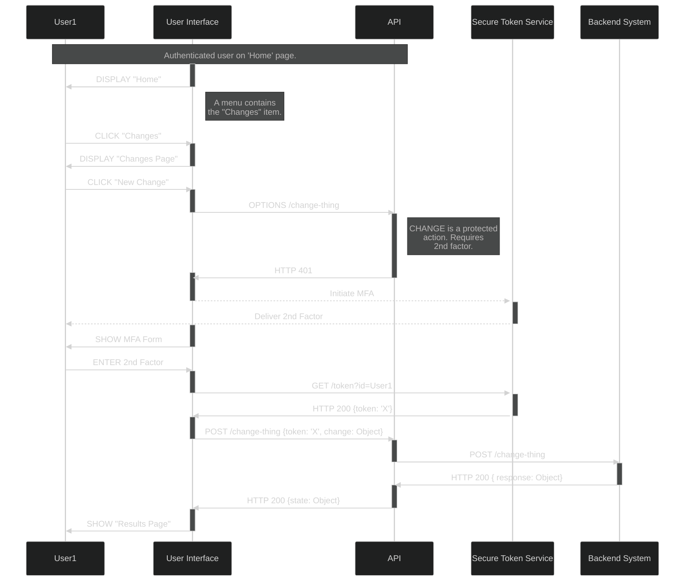

## CHANGE action with 2nd Authentication Factor

This sequence is explored in detail in the [Protecting Change With MFA](/posts/protecting-change-with-mfa/) post.

### 'Happy path' sequence

```mermaid
%%{ init: {"theme":"dark"}}%%
sequenceDiagram
  participant USER as User1
  participant UI as User Interface
  participant API as API
  participant IDP as Secure Token Service
  participant BACKEND as Backend System
  note over USER,API: Authenticated user on 'Home' page.
  activate UI
  UI ->> USER: DISPLAY "Home"
  deactivate UI
  note right of UI: A menu contains<br/>the "Changes" item.
  USER ->> UI: CLICK "Changes"
  activate UI
  UI ->> USER: DISPLAY "Changes Page"
  deactivate UI
  USER ->> UI: CLICK "New Change"
  activate UI
  UI ->> API: OPTIONS /change-thing
  deactivate UI
  activate API
  note right of API: CHANGE is a protected <br/> action. Requires <br/> 2nd factor.
  API ->> UI: HTTP 401
  activate UI
  deactivate API
  activate IDP
  UI -->> IDP: Initiate MFA
  deactivate UI
  activate IDP
  IDP -->> USER: Deliver 2nd Factor
  deactivate IDP
  activate UI
  UI ->> USER: SHOW MFA Form
  deactivate UI
  USER ->> UI: ENTER 2nd Factor
  activate UI
  UI ->> IDP: GET /token?id=User1
  deactivate UI
  activate IDP
  IDP ->> UI: HTTP 200 {token: 'X'}
  deactivate IDP
  activate UI
  UI ->> API: POST /change-thing {token: 'X', change: Object}
  deactivate UI
  activate API
  API ->> BACKEND: POST /change-thing
  deactivate API
  activate BACKEND
  BACKEND ->> API: HTTP 200 { response: Object}
  activate API
  deactivate BACKEND
  API ->> UI: HTTP 200 {state: Object}
  deactivate API
  activate UI
  UI ->> USER: SHOW "Results Page"
  deactivate UI
```
